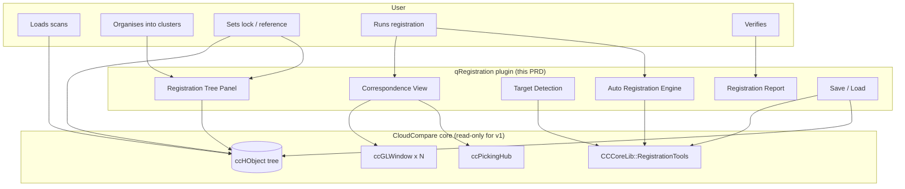

# Registration Workflow — Product Requirements Document

**Status:** Draft v0.1 · **Owner:** bramburn (Icelabz) · **Last updated:** 2026-08-18

This folder is the **product-facing PRD** for adding a Faro Scene Classic-style registration workflow to CloudCompare. It is the *what* and the *why*. For the *how* (architecture, file map, plugin recipe, code references), see the **agent-facing** docs that live alongside this one:

- [`../../AGENTS_REGISTRATION.md`](../../AGENTS_REGISTRATION.md) — goal-level doc, scope, milestones, risk register
- [`../../docs/context/registration/`](../../docs/context/registration/) — code-archaeology (data flow, picking, dual viewport, transform math)

The two doc sets are **intentionally separate** and **cross-link rather than duplicate**. If a future reader finds a contradiction, the PRD (this folder) wins on product decisions, the `docs/context/` wins on implementation decisions, and we treat the conflict as a bug.

---

## 0. How to read this folder

| # | File | Audience | When to read |
|---|---|---|---|
| **00** | `00-README.md` (this file) | Everyone | First. 5 minutes. |
| **01** | [`01-product-overview.md`](01-product-overview.md) | Product, dev, sales | "What problem are we solving and for whom?" |
| **02** | [`02-features.md`](02-features.md) | Product, dev, QA | "What does v1 actually include and what doesn't it?" |
| **03** | [`03-user-workflows.md`](03-user-workflows.md) | UX, dev, QA | "Walk me through the user doing the thing." |
| **04** | [`04-ui-pages.md`](04-ui-pages.md) | UX, dev, QA | "What does each screen look like?" |
| **05** | [`05-ux-patterns.md`](05-ux-patterns.md) | UX, dev, QA | "How do error states, edge cases, and undo work?" |
| **06** | [`06-architecture-and-api.md`](06-architecture-and-api.md) | Dev, plugin authors | "How is it built? What can I call from my plugin?" |
| **07** | [`07-roadmap.md`](07-roadmap.md) | Product, sales | "What did we cut and when does it come back?" |

**Diagrams convention.** Workflows and architecture use Mermaid. UI layouts use ASCII wireframes — the plugin doesn't exist yet, so generating fake mockup images would lock in visual decisions we don't want to commit to. Once the UI is built, swap ASCII for real screenshots in a `screens/` subfolder; the prose around them won't change.

**Glossary** (full version in §01; quick version here):

- **Scan** — one point cloud from one scanner setup
- **Cluster** — a folder that groups scans (and/or child clusters). The fundamental unit of registration.
- **Reference cluster** — within a parent, the one cluster that other clusters align to. At most one per parent.
- **Locked cluster** — a cluster whose internal registration is frozen; cannot be modified until unlocked.
- **Target** — a physical reference object (sphere, checkerboard, plane, manual marker) used for target-based registration.
- **Pair** — a (Source, Reference) tuple of corresponding points across two clouds, used for manual point-pair registration.
- **Rigid transform** — rotation + translation, no scale (v1). The output of every registration operation.

---

## 1. The one-paragraph summary

CloudCompare today has a single-window manual point-pair registration dialog (`qCC/ccPointPairRegistrationDlg.{h,cpp}`) and a plugin-scoped point-pair variant in `AGENTS_REGISTRATION.md`. That covers ~10% of what a surveyor actually needs. They also need to **group scans into clusters**, **lock and reference** clusters during multi-level registration, **detect targets automatically** (spheres, checkerboards), **run target-based, top-view, and cloud-to-cloud registration** in batch, **verify the result** with clipping boxes, and **save and reload** registration state. This PRD specifies v1 of that full workflow as a CloudCompare Standard plugin, modelled on Faro Scene Classic's `Correspondence View + clusters + lock + reference + multi-mode` pattern.

---

## 2. The two-tier lock model (the cornerstone decision)

Everything else in this PRD is downstream of this. If you disagree with it, stop and re-discuss.

A cluster has **two independent flags**:

| Flag | Effect when ON | Visual |
|---|---|---|
| **Locked** | The cluster's internal registration is frozen. You cannot add, remove, or re-pick pairs inside it. Its child scans/clusters cannot be re-registered against each other. Auto-detected targets inside are read-only. | 🔒 icon overlay on the cluster row in the registration tree. |
| **Reference** | Within its parent, this cluster is the alignment target. Sibling clusters (when registered at the parent level) move to align to it. At most one reference per parent. | 📍 icon overlay + bold name. |

These are **orthogonal**. A cluster can be locked-only, reference-only, both, or neither. The "lock both, then register them at the parent" workflow is the single most powerful pattern in Scene Classic; we copy it.

See [`02-features.md` §3](02-features.md#3-the-cluster-model) for the full behaviour matrix and [`04-ui-pages.md` §2](04-ui-pages.md#2-the-registration-tree-panel) for how it surfaces in the UI.

---

## 3. v1 scope — what we are building, what we are not

### 3.1 In scope for v1

1. **Cluster hierarchy** — folders of scans, with arbitrary nesting. Reuses CloudCompare's existing `ccHObject` tree.
2. **Two-tier lock + reference model** (above).
3. **Manual point-pair registration** — the existing scoped plugin becomes a *tool* in this workflow, not a standalone feature.
4. **Three auto-registration modes**: target-based (TBR), top-view based (TDR), cloud-to-cloud (C2C). TBR + C2C as a combined "Top View + C2C" preset is also included.
5. **Target detection**: spheres (with configurable radius) and checkerboards (with configurable size). Manual markers as a fallback when neither detector fires.
6. **Correspondence view** — dual `ccGLWindow` for picking point pairs across two clouds.
7. **Registration report** — RMS per pair + overall, displayed after each registration; saveable as a `.regreport.json` next to the project.
8. **Verify tools** — clipping boxes, unique-colour-by-scan / unique-colour-by-cluster render modes.
9. **Save / load** — registration state persisted via a JSON sidecar. Lock + reference flags survive save/load.
10. **CLI mode** — `-REGISTER -PROJECT foo.json -OUT out.bin` for batch processing of pre-configured cluster trees.
11. **Single-level undo** on the registration commit.

### 3.2 Out of scope for v1 (deferred — see [`07-roadmap.md`](07-roadmap.md))

- Hybrid registration (combining TBR + survey control + C2C in one pass)
- Plane-based registration
- On-site real-time registration
- Interactive Registration (the SCENE 2023.1 graph-based linkage editor)
- Geo-referencing / control point networks
- Moving-objects filter
- PDF registration reports (JSON in v1; PDF in v2)
- VR view (SCENE's "Virtual Reality View")
- On-site scanner compensation
- Batch processing UI
- Multi-level undo
- Texture-aware / colour-aware picking
- Synchronized camera views between the two correspondence viewports

### 3.3 Non-goals (we are explicitly not trying to be SCENE)

- We are **not** building a full scene-management platform. CloudCompare is a desktop point cloud tool; the registration feature should feel like a part of it, not a separate product embedded inside.
- We are **not** replacing `ccPointPairRegistrationDlg`. It stays for the single-window "I just need to align two clouds right now" flow. The new plugin is for the multi-scan, multi-cluster, multi-stage workflow.
- We are **not** a Faro replacement for *captured* data — we register what the user has already loaded. No scanner integration, no live on-site features.

---

## 4. The high-level architecture (one diagram)

**Read this as:** the plugin owns the user-facing surface (tree panel, correspondence view, detection, report, save/load) and delegates math to `CCCoreLib` and OpenGL to `ccGLWindow`. It writes lock + reference state to `ccHObject` metadata. It does **not** modify `qCC/`, `ccViewer/`, or `libs/` core for v1. Implementation details in [`06-architecture-and-api.md`](06-architecture-and-api.md).

---

## 5. Success criteria (v1 ships when all are true)

1. A user can take 6 scans organised into 2 pre-registered clusters of 3 scans each, drag them under a parent cluster, lock both, mark one as reference, and register the parent with the second as the moving cluster — all in <2 minutes of clicks.
2. The same user can take 4 scans with no targets, open a correspondence view, pick 4 point pairs, preview the rigid transform live, see RMS < 5mm, and commit.
3. A user can run a one-shot CLI: `CloudCompare -REGISTER -CLUSTERS project.json -OUT registered.bin` and get a registered `.bin` out, with the same report they'd get interactively.
4. Save the project, close CloudCompare, reopen, reload the project — the registration state, lock flags, reference flag, and pair tables all come back.
5. The plugin's source compiles with `cmake --fresh -DPLUGIN_STANDARD_QREGISTRATION=ON` and produces a `.dll` (Windows) / `.dylib` (macOS) / `.so` (Linux) that the host loads on startup.
6. All four CI jobs (Windows MSVC, macOS Clang, Ubuntu GCC, Ubuntu Clang) pass with `-DPLUGIN_STANDARD_QREGISTRATION=ON`.
7. `check-format` passes (clang-format, the project's existing style).
8. The plugin appears in **Help → About → Plugins** with name, version, author, and link to this PRD.

---

## 6. Glossary (one more pass, with cross-links)

| Term | Definition | See |
|---|---|---|
| **Scan** | One `.bin` / `.las` / `.e57` / `.ply` point cloud. | — |
| **Cluster** | A `ccHObject` folder that groups scans and/or child clusters. | [`02-features.md` §3](02-features.md#3-the-cluster-model) |
| **Reference** | Cluster-level flag. The sibling other clusters align to. | [`02-features.md` §3.2](02-features.md#32-the-two-tier-lock-model) |
| **Locked** | Cluster-level flag. Freezes internal registration. | [`02-features.md` §3.2](02-features.md#32-the-two-tier-lock-model) |
| **Target** | Physical reference object: sphere, checkerboard, plane marker, manual point. | [`02-features.md` §4.1](02-features.md#4-registration-modes) |
| **TBR** | Target-Based Registration. | [`02-features.md` §4.1](02-features.md#4-registration-modes) |
| **TDR** | Top-View (Down) Registration. Initial coarse alignment by projecting onto the XY plane. | [`02-features.md` §4.2](02-features.md#4-registration-modes) |
| **C2C** | Cloud-to-Cloud (ICP). | [`02-features.md` §4.3](02-features.md#4-registration-modes) |
| **Pair** | (Source, Reference) `CCVector3d` tuple. | [`02-features.md` §5](02-features.md#5-manual-point-pair-registration) |
| **Correspondence view** | The dual-viewport dialog where pairs are picked. | [`04-ui-pages.md` §3](04-ui-pages.md#3-correspondence-view) |
| **RMS** | Root-mean-square of per-pair distances after fitting the transform. | [`06-architecture-and-api.md` §4.3](06-architecture-and-api.md) |
| **Tension** | A registration that pulls a cluster in a direction its constraints can't accept; the user sees a high RMS that doesn't decrease with more pairs. | [`05-ux-patterns.md` §3](05-ux-patterns.md#3-tension) |
| **Verify** | The post-registration quality check using clipping boxes and per-scan / per-cluster colours. | [`04-ui-pages.md` §6](04-ui-pages.md#6-verify-overlay) |
| **Force correspondences** | Lock a target/pair identity so subsequent runs don't search for new ones. | [`02-features.md` §4.4](02-features.md#4-registration-modes) |
| **Top-down registration** | A pre-C2C coarse step that aligns clusters by their XY footprint. | [`02-features.md` §4.2](02-features.md#4-registration-modes) |

---

## 7. Open questions for review (not blockers)

These are things I'd like you to commit on *before* we start writing code, not before we write this PRD:

1. **Plugin name** — `qRegistration`, `qSceneRegistration`, `qMultiRegistration`, `qFaroStyle`? Affects `IID`, folder name, CMake flag. **My pick: `qRegistration`**, IID `ccorp.cloudcompare.plugin.qRegistration`.
2. **Should correspondence view also support `n > 2` clouds** (N-viewport for N>2 scans in a correspondence group)? SCENE Classic only does 2 at a time. v1 should match SCENE: 2 only. **My pick: 2-viewport for v1, N-viewport is v2.**
3. **Where does the registration tree panel live** — as a dock widget in the main window, as a separate window, or as a tab in the existing Properties dock? **My pick: dock widget**, dockable to the right of the db-tree, hideable.
4. **What file format for the registration report** — JSON is dev-friendly; CSV is spreadsheet-friendly; PDF is what surveyors send to clients. **My pick: JSON in v1, PDF in v2.** Surveyors can convert JSON→PDF with any tool they already use.
5. **Are global shifts (large coordinates) handled by this plugin or inherited from CloudCompare's existing `ccGlobalShiftManager`?** The existing one handles it. **My pick: inherit, don't reimplement.**

If you change any of these, the PRD will be updated. If you don't, the PRD is taken as the committed answer.

---

## 8. Pointers

- **This folder's neighbour in `docs/`** — [`../../docs/context/registration/`](../../docs/context/registration/) (agent-facing, code-archaeology)
- **Top-level goal doc** — [`../../AGENTS_REGISTRATION.md`](../../AGENTS_REGISTRATION.md) (milestones, risk register, scope)
- **Plugin recipe** — [`../../AGENTS-plugin-dev.md`](../../AGENTS-plugin-dev.md) (Standard plugin template)
- **Architecture overview** — [`../../AGENTS-architecture.md`](../../AGENTS-architecture.md)
- **Library ownership** — [`../../AGENTS-libs.md`](../../AGENTS-libs.md) (where `ccGLMatrix`, `ccPickingHub`, `ccMainAppInterface`, `ccOverlayDialog` live)
- **Coding standards** — [`../../AGENTS-coding-standards.md`](../../AGENTS-coding-standards.md) (file headers, naming, clang-format)
