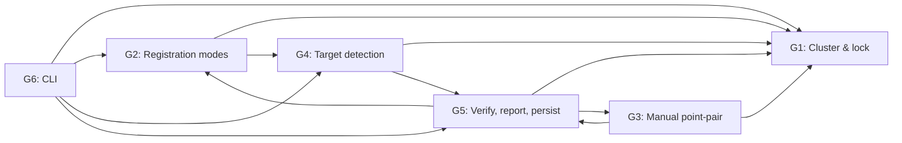

# 02 — Features

> **What does v1 actually include? What's cut? What's the priority order?**

This is the longest single document in the PRD because it's the spec of record. Every feature has an ID, a priority, an in-or-out-of-v1 status, and a behavioural description. When an LLM agent or a future contributor asks "what does this feature do?" — point them here.

---

## 1. Feature ID convention

Each feature has an ID of the form `FR-XX` (functional requirement). Stable across versions. If a feature is cut from v1, the ID is **not** reused — it stays in [`07-roadmap.md`](07-roadmap.md) with its v2/v3 status. This way, conversation references like "FR-12" still mean the same thing three years from now.

---

## 2. The five feature groups

```
G1. Cluster & lock model       — the data structure everything sits on
G2. Registration modes         — TBR / TDR / C2C / combined
G3. Manual point-pair          — the dual-viewport correspondence view
G4. Target detection           — sphere / checkerboard / manual
G5. Verify, report, persist    — the post-registration quality loop
```

Each feature below is tagged `[G?] [Priority: P0/P1/P2/P3] [Status: v1/Roadmap]`. **P0** blocks ship; **P1** is needed for the primary user story; **P2** is polish; **P3** is edge-case / post-launch.

---

## 3. G1. Cluster & lock model

### 3.1 The cluster hierarchy

**FR-01 [G1, P0, v1]** — A **cluster** is a `ccHObject` folder that groups scans and/or child clusters. The plugin works with the existing `ccHObject` tree; it does not introduce a new container type. Clusters are visualised in the registration tree panel (see [`04-ui-pages.md` §2](04-ui-pages.md#2-the-registration-tree-panel)) and also in the main db-tree with a special icon.

**FR-02 [G1, P0, v1]** — Cluster nesting is **arbitrary**. A cluster can contain scans and other clusters to any depth. The two-tier lock + reference model applies at every level.

**FR-03 [G1, P0, v1]** — **A cluster with no scans and no children is invalid and auto-deleted on save.** This prevents clutter.

**FR-04 [G1, P1, v1]** — Right-click on the db-tree → "Create registration cluster from selection" creates a cluster containing the currently selected scans. Default name is "Cluster 1", "Cluster 2", ...; user can rename inline.

**FR-05 [G1, P1, v1]** — Drag-and-drop between clusters and the db-tree root. Multi-select drag works. Drop targets highlight on hover.

**FR-06 [G1, P2, v1]** — Drag-reorder within a cluster (re-orders the cluster's children). Useful when the user wants to enforce a particular cluster ordering for "register in this order" mode.

### 3.2 The two-tier lock model

The corner-stone. Restating from the README so it's also in the feature spec:

**FR-10 [G1, P0, v1]** — Each cluster has two **independent** boolean flags: **Locked** and **Reference**.

**FR-11 [G1, P0, v1] — Locked behaviour:**
- A locked cluster's internal registration is frozen. Operations that would change the relative pose of any two children of the locked cluster are **disabled at the UI level** and **rejected at the API level**.
- Specifically disabled: auto-register (any mode) between two children of the locked cluster, manual point-pair pick within the locked cluster, target detection within the locked cluster, moving a child of the locked cluster to a different parent cluster.
- Specifically still **enabled**: viewing the cluster, viewing its registration report, removing a child from the cluster (which deletes the child, not moves it), renaming, undoing a previous operation that put the cluster in this state.
- Lock state **persists** across save/load.
- Lock state is **per-cluster, not per-scan**. A scan inherits lock from its parent cluster.

**FR-12 [G1, P0, v1] — Reference behaviour:**
- A cluster can be marked as the **Reference** of its parent. At most one cluster per parent can be the reference.
- When registering at the parent level (between sibling clusters), the reference cluster is treated as the **fixed** one; non-reference siblings move to align to it.
- If no sibling is marked as reference, registration fails with an actionable error: "Mark one cluster as the reference (📍) before registering siblings."
- Reference state **persists** across save/load.
- Setting "Reference" on a cluster auto-clears Reference on any other sibling.

**FR-13 [G1, P0, v1] — Interaction between lock and reference:**
- A cluster can be **both Locked and Reference**. This is the canonical "lock + reference at parent level" SCENE pattern. See workflow W4 in [`03-user-workflows.md`](03-user-workflows.md#workflow-4-multi-cluster-composition-the-killer-feature).
- A cluster can be **Locked only** (its internal registration is good, but it's not the reference at the parent level).
- A cluster can be **Reference only** (you're about to align siblings to it; lock comes later when you're happy with the alignment).
- A cluster can be **neither** (default; it can be edited freely).

**FR-14 [G1, P0, v1]** — Lock state and Reference state are **first-class serialisable properties** of the cluster. They live in a JSON sidecar (`.qreg.json`) alongside the project, NOT in the `.bin` blob. This keeps save/load versioning simple — see [`06-architecture-and-api.md` §6.2](06-architecture-and-api.md#62-sidecar-format).

**FR-15 [G1, P1, v1]** — Visual indicators in the registration tree:
- **Locked:** 🔒 icon overlay on the cluster row, plus a tinted background (subtle grey).
- **Reference:** 📍 icon overlay, plus the cluster name is **bold**.
- **Both:** both icons, name bold, background slightly more saturated.
- **Neither:** plain row, no icon.

**FR-16 [G1, P1, v1]** — Right-click on a cluster row in the registration tree → "Lock", "Unlock", "Set as reference", "Clear reference", "Rename", "Delete", "Properties…". The context menu's lock / reference options are toggle actions with state-aware labels ("Lock" → "Unlock" if already locked).

**FR-17 [G1, P2, v1]** — Hover on the lock / reference icon shows a tooltip explaining its effect in one sentence ("Lock freezes the cluster's internal registration").

**FR-18 [G1, P0, v1]** — **Lock + reference is enforced in the API, not just the UI.** A plugin that calls into `ccRegistrationPlugin::autoRegisterChildrenOf(parent)` on a cluster that contains a locked child gets a `ccRegistrationPlugin::ClusterLockedError`. This means the protection survives bad UI / shortcut keys / future contributors.

### 3.3 The cluster's registration state

**FR-20 [G1, P0, v1]** — Each cluster has a `RegistrationState` enum:
- `UNREGISTERED` — no registration has been performed.
- `REGISTERED` — at least one successful registration, current state is good.
- `STALE` — the cluster's children have been modified since the last registration (a scan was added, removed, replaced, or its transform was edited manually).
- `FAILED` — last registration attempt failed (e.g. RMS above threshold, ICP diverged).

**FR-21 [G1, P0, v1]** — A small status icon next to each cluster row indicates the state. STALE / FAILED get a warning yellow / red. See [`04-ui-pages.md` §2](04-ui-pages.md#2-the-registration-tree-panel) for the icon set.

**FR-22 [G1, P1, v1]** — Hovering the status icon shows the state and (if relevant) the last registration timestamp and RMS.

**FR-23 [G1, P2, v1]** — "Re-validate all" command: walks the tree, marks any cluster as STALE whose children have changed, and surfaces them in a summary dialog.

---

## 4. G2. Registration modes

Five registration modes ship in v1. They're all variations on the same primitives (transform fit + per-pair / per-target residual report). The plugin surfaces them as separate modes because the user expects to choose.

### 4.1 TBR — Target-Based Registration

**FR-30 [G2, P0, v1]** — TBR registers a cluster by detecting physical targets (spheres, checkerboards) in the child scans, matching them by **target name** or by **nearest geometric neighbour**, and fitting a rigid transform per pair of children.

**FR-31 [G2, P0, v1]** — Target detection runs **per scan** at registration time. Detected targets are stored in the scan's metadata and become the candidate set for matching.

**FR-32 [G2, P0, v1]** — Target matching supports two strategies:
- **Forced correspondences by name** — if a target is named "T1" in scan A and "T1" in scan B, they're matched. (This is the SCENE "Force correspondences by target names" setting.)
- **Geometric nearest** — within a configurable radius, each target in scan A is matched to the nearest target in scan B by 3D position. Faster but riskier if the scans aren't already coarsely aligned.

**FR-33 [G2, P1, v1]** — At least 3 matched targets required to fit a rigid transform. If only 2 are matched, the result is reported as under-constrained and not applied. The user sees a dialog: "Only 2 targets matched between Scan A and Scan B. Need ≥3. Adjust target detection or pick manually."

**FR-34 [G2, P0, v1]** — Outlier rejection: targets whose residual after the fit exceeds `3 × RMS` (configurable) are removed and the fit re-run, until stable. Max 3 iterations to avoid infinite loops.

**FR-35 [G2, P0, v1]** — On success, the per-pair (per-target) residuals and the overall RMS are written to the registration report. Per-pair distances are colour-coded: green < 5mm, yellow 5-15mm, red > 15mm. Thresholds are configurable.

**FR-36 [G2, P0, v1]** — "Force current correspondences" option: once the user has reviewed and accepted a set of target matches, they can lock them. Subsequent re-runs use the same matches and don't re-search. This is critical for the "register the cluster, lock it, register the parent" workflow — the targets in the locked cluster are read-only at the parent level.

### 4.2 TDR — Top-View (Down) Registration

**FR-40 [G2, P1, v1]** — TDR is a **coarse** alignment step: each scan's points are projected onto the XY plane (or the best-fit horizontal plane) and the centroids of the resulting 2D point sets are aligned. Cheap; useful as a first pass before C2C.

**FR-41 [G2, P1, v1]** — TDR requires the user to have set a "scene up" direction. Default is +Z = up. Configurable per project.

**FR-42 [G2, P2, v1]** — TDR is exposed as a separate mode AND as the "Coarse" step in a "Coarse + C2C" combined preset.

### 4.3 C2C — Cloud-to-Cloud (ICP)

**FR-50 [G2, P0, v1]** — C2C is the standard ICP. The plugin wraps `CCCoreLib::ICP` (or, if unavailable, implements Umeyama + ICP from scratch using the existing `RegistrationTools` namespace).

**FR-51 [G2, P0, v1]** — ICP requires a **coarse initial alignment** within a configurable radius (default 10m, configurable in project settings). If the scans are too far apart, ICP diverges. The plugin surfaces a clear error: "Scans too far apart for ICP. Run TDR first or pick manual point pairs."

**FR-52 [G2, P0, v1]** — ICP is exposed as a separate mode AND as the "Refine" step in a "TDR + C2C" combined preset.

**FR-53 [G2, P0, v1]** — ICP stops when either (a) the RMS improvement between iterations drops below 0.1mm, (b) max iterations reached (default 50, configurable), or (c) the transformation starts oscillating (we use a 3-iteration rolling-window divergence check).

**FR-54 [G2, P2, v1]** — ICP supports a **multi-resolution** mode: subsample to 50%, 25%, 12% and run ICP at each level. Default off; user enables per-registration.

### 4.4 Combined modes (presets)

**FR-60 [G2, P0, v1]** — **TDR + C2C** is a single command that runs TDR then C2C and produces a single report with the per-step RMS.

**FR-61 [G2, P1, v1]** — **Top View + C2C** is exposed as a UI preset (the "auto-register" button in the panel defaults to this). The Faro SCENE default for targetless registration.

### 4.5 What about the other modes SCENE has?

| SCENE mode | v1? | Notes |
|---|---|---|
| TBR (target-based) | ✅ FR-30 | Core |
| TDR (top-view) | ✅ FR-40 | Core |
| C2C (cloud-to-cloud) | ✅ FR-50 | Core |
| TDR + C2C combined | ✅ FR-60 | Core |
| Manual markers as targets | ✅ FR-91 | Folded into target detection |
| **Hybrid** (TBR + survey control + C2C) | ❌ v2 | DF-01; needs survey control |
| **Plane-based** registration | ❌ v2 | DF-03 |
| **On-site / real-time** registration | ❌ v3 | DF-20; vendor SDK |
| **Interactive registration** (graph) | ❌ v2 | DF-07; SCENE 2023.1+ feature |

---

## 5. G3. Manual point-pair registration

**FR-70 [G3, P0, v1]** — A user can open the **Correspondence View** with two selected clusters (or two scans, or one of each) and pick corresponding point pairs across them. The Correspondence View is the dual-`ccGLWindow` dialog scoped in [`../../AGENTS_REGISTRATION.md`](../../AGENTS_REGISTRATION.md) §3 and detailed in [`04-ui-pages.md` §3](04-ui-pages.md#3-correspondence-view).

**FR-71 [G3, P0, v1]** — Pairs are auto-paired by insertion order: first A-pick + first B-pick = pair 1; second A-pick + second B-pick = pair 2; etc. The user can re-order, delete, and add individual pairs.

**FR-72 [G3, P0, v1]** — **Minimum 3 pairs** required to fit a rigid transform. The "Preview" button is disabled with a tooltip until 3 pairs exist.

**FR-73 [G3, P0, v1]** — **Live preview.** A "Preview" button fits the transform via `UmeyamaRegistration` (rigid-only, scale discarded) and applies it via `ccDrawableObject::setGLTransformation` to the "aligned" cloud. The user sees the cloud move in real time. The preview is display-only; cancelling the dialog reverts.

**FR-74 [G3, P0, v1]** — **RMS per pair + overall** are displayed in a table below the viewports. Per-pair residuals update live as the user adds/removes pairs.

**FR-75 [G3, P0, v1]** — **Apply** commits the transform via `ccPointCloud::applyRigidTransformation` and updates the db-tree. The dialog closes.

**FR-76 [G3, P0, v1]** — **Reset** clears all pairs.

**FR-77 [G3, P0, v1]** — **Save pair set / Load pair set** as a `.qpairs.json` file. Re-load across sessions. Optional but cheap; see §11.

**FR-78 [G3, P1, v1]** — The user can swap which cloud is "aligned" (moves) and which is "reference" (stays fixed) without re-picking pairs. The transform re-fits automatically.

**FR-79 [G3, P1, v1]** — The user can show / hide the picked points in the 3D viewports as `cc2DLabel` markers (per-`ccGLWindow`, not in the main db-tree — see [`../../docs/context/registration/dual-viewport.md` §3](../../docs/context/registration/dual-viewport.md)).

**FR-80 [G3, P2, v1]** — Hotkeys: `A` = pick in viewport A, `B` = pick in viewport B, `Delete` = remove the selected pair row. Reduces mouse mileage.

---

## 6. G4. Target detection

**FR-90 [G4, P0, v1]** — The plugin auto-detects two target types:
- **Spheres** — Hough transform on local curvature, with user-configurable radius (default 70mm, range 10-300mm). Detected spheres are sized and named automatically.
- **Checkerboards** — pattern detection in the per-point intensity / colour field, with user-configurable square size. Detected checkerboards are named automatically.

**FR-91 [G4, P0, v1]** — **Manual markers** as a third option: the user clicks a point in the 3D viewport and a "manual target" with a name they choose is added. Used as a fallback when sphere / checkerboard detection misses or when the user has unusual reference objects.

**FR-92 [G4, P0, v1]** — Target detection runs **per scan** and is a prerequisite for TBR. It can also be run on demand (right-click scan → "Detect targets").

**FR-93 [G4, P1, v1]** — Target preview: detected targets are rendered as wireframe spheres / checkerboard icons in the 3D viewport. User can show / hide them.

**FR-94 [G4, P1, v1]** — Target editor: clicking a detected target opens a small inline editor to rename it, adjust its radius (if sphere), or delete it. The target list is per-scan.

**FR-95 [G4, P2, v1]** — **Target visualisation toggle** in the main 3D viewport's toolbar: "Show all targets", "Show targets in selected cluster", "Hide all targets".

---

## 7. G5. Verify, report, persist

### 7.1 Verify

**FR-100 [G5, P0, v1]** — **Clipping boxes** for verify. The user can place one or more axis-aligned or free-form clipping boxes in the 3D viewport. Inside the box, points from different scans/clusters are visible; outside, they're hidden. This is the SCENE verify workflow.

**FR-101 [G5, P0, v1]** — **Unique-colour-by-scan** and **Unique-colour-by-cluster** render modes. In these modes, each scan (or cluster) is rendered in a distinct high-contrast colour so the user can see overlap and misregistration visually. Reuses CloudCompare's existing scalar-field colourisation but with a "categorical" palette rather than a gradient.

**FR-102 [G5, P1, v1]** — **Scan-point distance measurement**: pick two points in different scans, get the distance in mm. Useful for "is this registration tight enough?" judgement.

### 7.2 Report

**FR-110 [G5, P0, v1]** — Every registration commit produces a **Registration Report** in JSON. Schema:
```json
{
  "schemaVersion": "1.0",
  "clusterPath": "/Project/Site/Building/Floor1",
  "mode": "TBR",
  "timestamp": "2026-08-18T22:00:00Z",
  "scans": 8,
  "targets": 24,
  "rmsOverall": 0.0032,
  "rmsUnits": "m",
  "pairs": [
    {"a": "Scan1", "b": "Scan2", "rms": 0.0028, "matchedTargets": 3},
    {"a": "Scan1", "b": "Scan3", "rms": 0.0041, "matchedTargets": 4}
  ],
  "transforms": [
    {"scan": "Scan2", "matrix": [1.0, 0.0, 0.0, 0.0, ...]}
  ]
}
```

**FR-111 [G5, P0, v1]** — Reports are saved to a sidecar `.qreg.json` next to the `.bin`. The plugin maintains a directory of reports per project.

**FR-112 [G5, P1, v1]** — Reports viewer: a dialog that lists all reports in the project, sortable by date / cluster / RMS, with a click-to-open detail view.

### 7.3 Save / load

**FR-120 [G5, P0, v1]** — Cluster hierarchy, lock flags, reference flags, registration reports, and pair sets all persist across save / load via the `.qreg.json` sidecar.

**FR-121 [G5, P0, v1]** — Transforms are committed to the `.bin` blob (the existing `applyRigidTransformation` path) when the user clicks Apply. The sidecar is the *metadata*; the `.bin` is the *transformed geometry*.

**FR-122 [G5, P1, v1]** — **Forward-compatibility**: when loading a project saved by a newer version, the user sees a "this project was saved by v1.2; you're running v1.0. Some features may be unavailable" warning but the project still loads.

**FR-123 [G5, P0, v1]** — **Backward-compatibility**: when loading a project saved by an older version, missing fields are filled with sensible defaults (e.g. a missing `locked` field → false).

**FR-124 [G5, P1, v1]** — Manual "Export project" and "Import project" commands for the sidecar, for sharing a registration state without sharing the raw point cloud.

### 7.4 Undo

**FR-130 [G5, P0, v1]** — **Single-level undo** on the registration commit. The previous transformation matrix is stored in the sidecar; "Undo last commit" reverts the geometry to its pre-commit pose and re-applies the prior transform.

**FR-131 [G5, P2, v1]** — Multi-level undo (a stack of 10+ operations) is **v3**. Documented in [`07-roadmap.md`](07-roadmap.md).

---

## 8. G6. CLI (cross-cutting)

**FR-140 [G6, P0, v1]** — The plugin registers a CLI command with `ccCommandLineInterface::Command`:

```
CloudCompare -REGISTER \
  -PROJECT project.json \
  -OUT registered.bin \
  [-MODE TBR|TDR|C2C|TDR_C2C] \
  [-VERBOSE] \
  [-SAVE_REPORT report.json]
```

**FR-141 [G6, P0, v1]** — `-PROJECT` is a JSON file matching the sidecar schema. The plugin loads the cluster tree, runs the requested registration mode(s) per cluster, saves the report, and writes the transformed `.bin`.

**FR-142 [G6, P1, v1]** — `-BATCH` mode: a directory of `.json` projects, processed sequentially. Reports go in a `_reports/` subfolder.

**FR-143 [G6, P1, v1]** — Exit codes: 0 = all registrations succeeded, 1 = some failed (with details in stderr), 2 = invalid arguments.

---

## 9. What we explicitly do NOT support in v1

Deferred features live in [`07-roadmap.md`](07-roadmap.md) with their DF-XX IDs. The headline omissions:

- ❌ Hybrid registration (TBR + survey control + C2C in one pass) — DF-01
- ❌ Plane-based registration — DF-03
- ❌ On-site / real-time registration — DF-20
- ❌ Interactive Registration graph editor — DF-07
- ❌ Geo-referencing / survey control — DF-02
- ❌ Moving-objects filter — DF-25
- ❌ PDF registration reports (JSON in v1) — DF-05
- ❌ VR view — DF-21
- ❌ Batch processing UI (CLI only in v1) — DF-06
- ❌ Multi-level undo (single only) — DF-08
- ❌ Texture / colour-aware picking — DF-10
- ❌ Synchronized camera views — DF-09
- ❌ N-viewport correspondence (only 2 in v1) — DF-04
- ❌ Coordinate system transformations (user works in scanner-native coords)

---

## 10. Priority matrix — one-glance summary

| ID range | Feature | Group | Priority |
|---|---|---|---|
| FR-01–06 | Cluster hierarchy | G1 | P0/P1/P2 |
| FR-10–18 | Lock + reference model | G1 | **P0** |
| FR-20–23 | Cluster registration state | G1 | P0/P1/P2 |
| FR-30–36 | TBR | G2 | P0/P1 |
| FR-40–42 | TDR | G2 | P1/P2 |
| FR-50–54 | C2C (ICP) | G2 | P0 |
| FR-60–61 | TDR + C2C combined | G2 | P0/P1 |
| FR-70–80 | Manual point-pair + correspondence view | G3 | P0/P1/P2 |
| FR-90–95 | Target detection (sphere / checkerboard / manual) | G4 | P0/P1/P2 |
| FR-100–102 | Verify (clipping boxes, unique colours) | G5 | P0/P1 |
| FR-110–112 | Registration report (JSON) | G5 | P0/P1 |
| FR-120–124 | Save / load (sidecar) | G5 | P0/P1 |
| FR-130–131 | Undo (single-level) | G5 | P0 |
| FR-140–143 | CLI | G6 | P0/P1 |

All features in v1 — none deferred from this list. See [`07-roadmap.md`](07-roadmap.md) for the features that were *never* in v1.

---

## 11. Feature dependency graph



**Read this as:** G1 is the foundation. G2 and G4 need G1. G3 needs G1. G5 is cross-cutting (consumes the other four). G6 is the CLI surface for everything.

**Implementation order:** G1 → G4 → G2 → G3 → G5 → G6. This matches the milestone order in [`../../AGENTS_REGISTRATION.md` §5](../../AGENTS_REGISTRATION.md).

---

## 12. Pointers

- **The "how users do it"** — [`03-user-workflows.md`](03-user-workflows.md)
- **The "what it looks like"** — [`04-ui-pages.md`](04-ui-pages.md)
- **The "how it's built"** — [`06-architecture-and-api.md`](06-architecture-and-api.md)
- **The "what we cut"** — [`07-roadmap.md`](07-roadmap.md)
- **The feature parity matrix vs SCENE** — [`07-roadmap.md` §3](07-roadmap.md#3-feature-parity-matrix-vs-faro-scene-classic)
