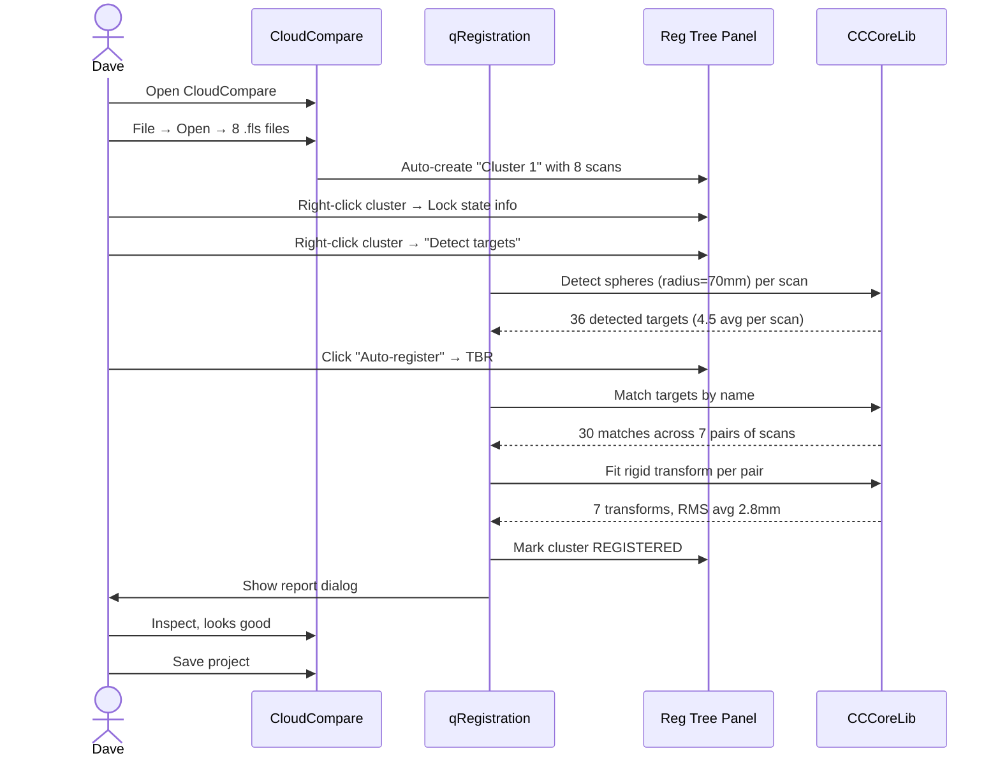
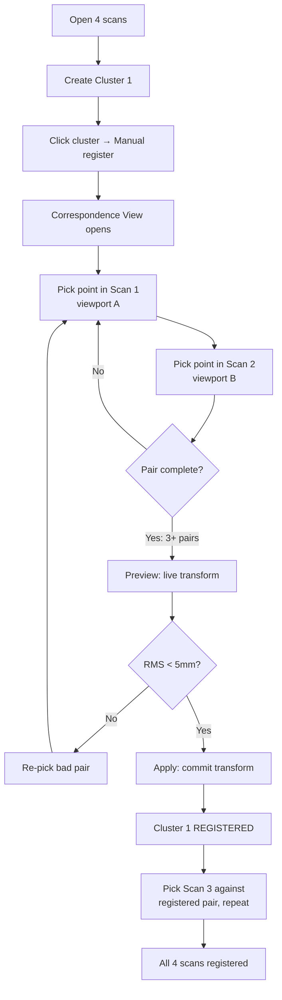
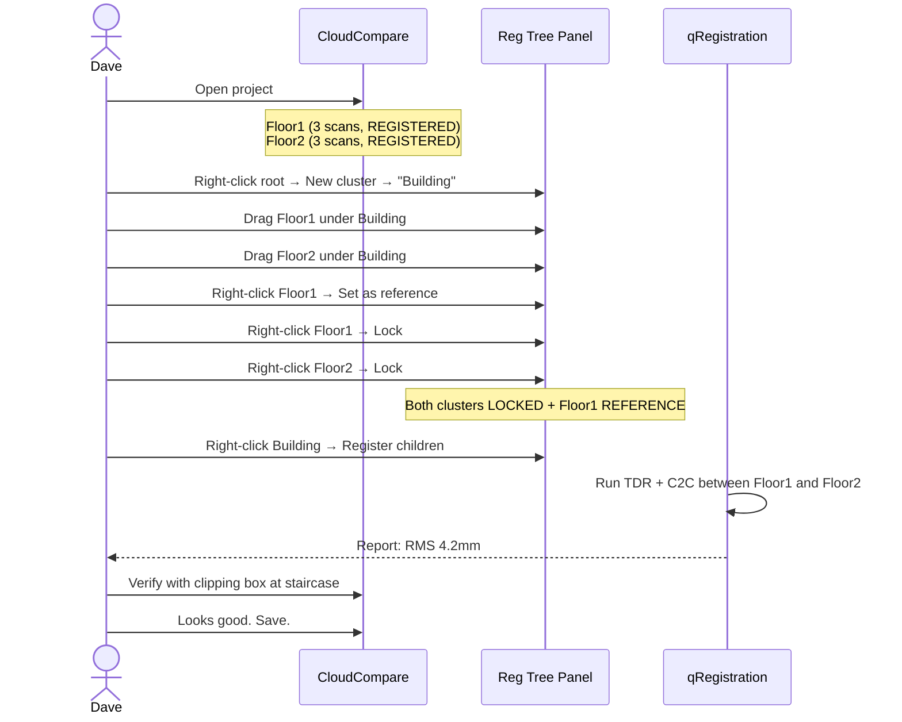
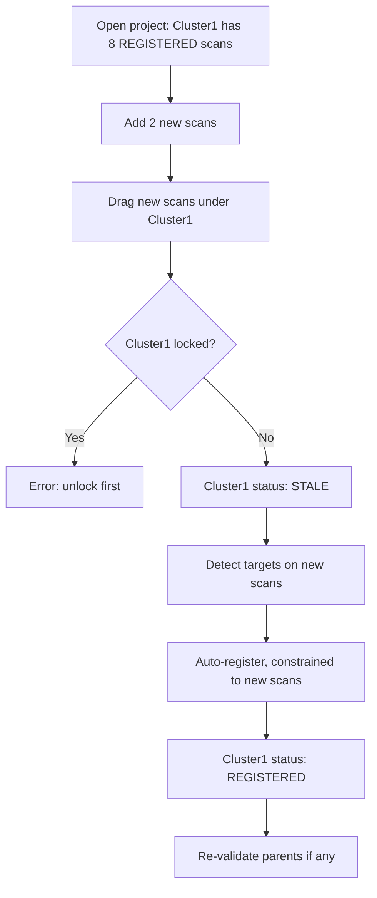
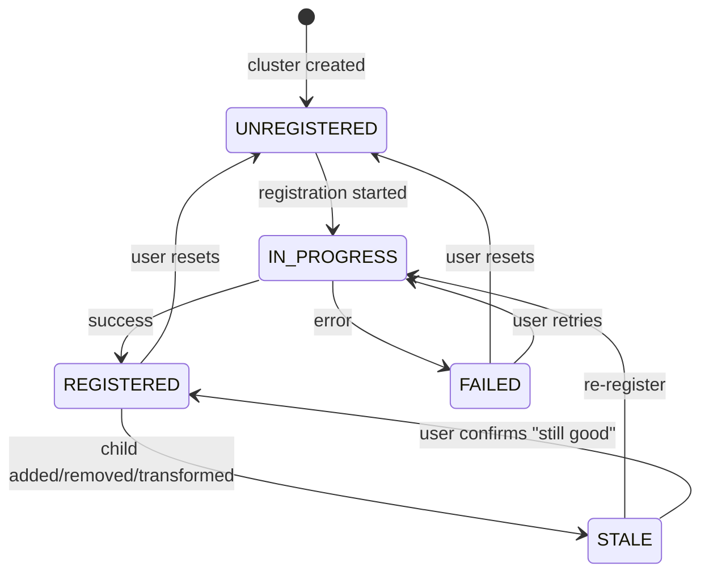

# 03 — User Workflows

> **Walk me through the user actually doing the thing.**

This document is for UX, dev, and QA. It is the contract between "what the user does" and "what the system does in response". Every workflow here is **verifiable**: if you can't sit down and click through it in the finished plugin, the workflow spec is wrong.

The diagrams use Mermaid. The prose is what a real user would feel and what the system has to do in response. Error cases are explicit.

---

## 0. The cast of characters (recap)

- **Dave** — the solo surveyor, primary persona. 8-15 scan jobs. 5mm tolerance. Familiar with SCENE but wants vendor-neutral.
- **You** — the Icelabz dev. Same hardware constraints as Dave plus dev time.
- **The plugin** — `qRegistration`, referred to as "the plugin" in workflow prose.

---

## 1. Workflow 1 — "I have 8 scans with spheres, register them"

This is the bread-and-butter. Dave's most common job.

### 1.1 The setup

- Dave has 8 scans in his project folder, captured with 70mm spheres placed around the scene.
- Each scan has 4-6 spheres visible in it.
- Overlap between adjacent scans is 30% (the SCENE / industry rule of thumb).

### 1.2 The user journey



### 1.3 Step-by-step (what Dave sees)

1. **Open CloudCompare.** Empty project.
2. **File → Open.** Selects 8 `.fls` files (or `.e57`, `.las` — any supported format). Each loads as a `ccPointCloud`.
3. **First-time-use auto-prompt.** "Would you like to organise these into a registration cluster?" → Yes → "Cluster 1" appears in both the db-tree and the registration tree panel, containing all 8 scans.
4. **Open the Registration Tree Panel** (View → Panels → Registration Tree, or it auto-opens the first time).
5. **Right-click "Cluster 1" → Detect targets → Spheres (radius 70mm).** Detection runs. Each scan gets a target list; detected targets appear as wireframe spheres in the 3D viewport.
6. **Review the target list** (optional). Click each target to see its name, position, and source scan. Rename / delete as needed.
7. **Right-click "Cluster 1" → Auto-register → TBR.** Progress bar. ~5-15 seconds for 8 scans.
8. **Report dialog appears.** Overall RMS: 2.8mm. Per-pair breakdown. Green / yellow / red colouring. Each scan's status is REGISTERED in the registration tree.
9. **Verify** (Dave is SCENE-trained; he always verifies). Clipping box around the staircase, check overlap between Scan 3 and Scan 4.
10. **Save.** File → Save Project. `.bin` for the geometry, `.qreg.json` sidecar for the registration state.
11. **Done.** Total time: ~3 minutes from open to saved registered project.

### 1.4 Error cases

| Failure | What the user sees | What the plugin does |
|---|---|---|
| Sphere radius wrong (Dave entered 140mm, his spheres are 70mm) | "Detected 0 spheres. Try a smaller radius." | Reports 0 detections, doesn't crash. |
| Some scans have no spheres | Those scans stay UNREGISTERED in the tree. The rest register. | Skips scans with no targets; doesn't fail the whole cluster. |
| Targets mis-matched (same name in two scans but they're different physical spheres) | High RMS for one pair, 12mm. | Highlights the bad pair in red in the report. |
| ICP diverges after TBR | RMS doesn't decrease below 5mm. | Marks the cluster STALE, suggests TDR + C2C. |

---

## 2. Workflow 2 — "I have 4 scans with no targets, register them manually"

The fallback. No spheres, no checkerboards, just geometry.

### 2.1 The setup

- 4 scans of a small room.
- No reference objects in the scene.
- User has to pick common features by eye.

### 2.2 The user journey



### 2.3 Step-by-step

1. **Open 4 scans.** Auto-cluster prompt → "Cluster 1".
2. **Right-click Cluster 1 → Manual register.** Opens the **Correspondence View** (dual viewport dialog).
3. **Select the two scans to register first** (e.g. Scan 1 and Scan 2 from the dropdowns).
4. **Viewport A** shows Scan 1; **Viewport B** shows Scan 2. Each can be panned / rotated / zoomed independently.
5. **Status bar:** "Pick a point in the SOURCE cloud (left)". User clicks a corner of a window frame in viewport A. A `cc2DLabel` "A1" appears.
6. **Status bar updates:** "Pick a corresponding point in the REFERENCE cloud (right)". User clicks the same corner in viewport B. `cc2DLabel` "B1" appears. Pair table row 1: A1 (1.234, 5.678, 0.012), B1 (1.245, 5.690, 0.008), distance 18.3mm.
7. **Repeat** for at least 3 pairs.
8. **Click Preview.** Plugin fits the rigid transform (Umeyama, scale discarded). The source cloud visibly moves. Per-pair residuals update.
9. **If RMS is bad** (> 5mm), review the pair table. The bad pair (highest residual) is red. Click "Remove", re-pick, retry.
10. **If RMS is good**, click **Apply**. Transform is committed. Dialog closes. Tree shows Scan 1 + Scan 2 as REGISTERED.
11. **Repeat for Scan 3 + (Scan 1+Scan 2)**, then Scan 4. Save.

### 2.4 Edge cases

| Edge | Behaviour |
|---|---|
| User picks a point in viewport B first (status bar said A) | Plugin accepts it; re-labels the pair as (B1, A1) implicitly; user can swap A/B at any time. |
| User picks 5 points in A, then realises they should have picked in B | User can drag the last 4 A-points to B (UI affordance: "Move to other viewport" button on selected row). |
| Two scans have wildly different scale (e.g. one is in mm, one in m) | Preview shows the cloud in a totally wrong position. RMS is huge. User is told "scale mismatch detected; only rigid registration is supported in v1." |
| User accidentally clicks the same point twice in A | No new pair; status bar says "Pick the next point in B". |
| Preview crashes the renderer on a 50M-point cloud | Plugin uses `setGLTransformation` which is cheap; the renderer only redraws on user action. We test this against 50M+ clouds before ship. |

---

## 3. Workflow 3 — "I have 2 sub-clusters of 3 scans each; register them together"

The killer feature. This is the workflow that makes the plugin worth the install.

### 3.1 The setup

- 6 scans, already pre-organised into 2 clusters: "Floor1" (3 scans) and "Floor2" (3 scans).
- Each cluster is internally registered. RMS < 3mm within each cluster.
- The user wants to register the two floors together at the staircase transition.

### 3.2 The user journey



### 3.3 Step-by-step

1. **Open the project.** Floor1 and Floor2 are in the registration tree, both REGISTERED, both currently unlocked.
2. **Create a parent cluster.** Right-click the root ("Project") → New cluster → "Building". An empty cluster appears.
3. **Drag Floor1 and Floor2 under Building.** Their REGISTERED status is preserved.
4. **Set Floor1 as reference.** Right-click Floor1 → "Set as reference". 📍 icon appears. Bold name. (Floor2's reference state auto-clears.)
5. **Lock both clusters.** Right-click Floor1 → "Lock", then Floor2 → "Lock". Both now show 🔒. Floor1 is **both locked and reference**; Floor2 is **locked only**.
6. **Right-click Building → "Register children".** Plugin runs TDR + C2C between the two locked sub-clusters. Floor1 stays put (reference, locked). Floor2 moves to align. Time: ~10-30 seconds.
7. **Report dialog.** RMS: 4.2mm. Per-pair: 4.0mm, 4.3mm, 4.4mm. All green.
8. **Verify at the staircase.** Dave places a clipping box at the staircase transition. He sees the floor edges meet cleanly.
9. **Save.** Both clusters' lock states persist; the parent's transform is committed; the sidecar records the multi-level relationship.

### 3.4 Why this is the killer feature

Before this workflow, Dave's only options were:

- **Open SCENE.** Pay the seat fee. Use SCENE's cluster model. Import the result into CloudCompare.
- **Re-register everything from scratch in CloudCompare.** Lose the per-cluster optimisation. Take 10x longer. Get worse RMS.

With this workflow, Dave keeps his carefully optimised per-cluster registrations, locks them, and just registers the parent. **10 minutes vs 2 hours.** That's the entire pitch.

### 3.5 Edge cases

| Edge | Behaviour |
|---|---|
| User tries to register Building with no reference set | Error: "Mark one child cluster as the reference (📍) before registering siblings." |
| User tries to register Building with 3 children, one reference | Plugin registers the 2 non-reference children against the reference. Both get moved. |
| User tries to drag a scan out of a locked cluster | Drag is rejected with a tooltip: "Cluster is locked. Unlock first to move children." |
| User tries to "Detect targets" inside a locked cluster | Tool is disabled in the context menu. |
| User un-locks Floor1, then re-registers it internally | Floor1's transform changes. The parent's registration of Floor2 is **now stale**. The plugin marks the parent as STALE. Dave is told: "Building's children have changed; re-validate." |

---

## 4. Workflow 4 — "I want to add 2 more scans to my already-registered cluster"

The "I'm on site and I forgot a corner" workflow.

### 4.1 The user journey



### 4.2 Step-by-step

1. **Open the project.** Cluster1 is REGISTERED, locked, with 8 scans.
2. **Add the 2 new scans.** File → Open → 2 new `.fls` files. They land in the db-tree root.
3. **Drag them into Cluster1.** Drag is rejected (Cluster1 is locked). Tooltip: "Cluster is locked. Unlock first to move children."
4. **Unlock Cluster1.** Right-click → Unlock. 🔒 disappears.
5. **Drag the 2 new scans into Cluster1.** Now Cluster1 has 10 scans. Its status flips to **STALE** (the cluster has changed since the last registration).
6. **Detect targets on the 2 new scans** (the existing 8 already have targets).
7. **Auto-register, constrained to "new scans only".** This is a new option in the auto-register dialog: "Register new scans against the registered cluster" (vs "Re-register everything from scratch"). The plugin forces correspondences on the existing 8 scans (uses their current transforms) and fits transforms for the 2 new ones only.
8. **Status: REGISTERED.** Per-pair residuals for the 2 new scans are reported.
9. **Re-validate parents.** If Cluster1 has a parent that's locked + registered, the parent is now STALE because Cluster1's transform *relative to its parent* didn't change, but the children *within* Cluster1 did. Wait — actually the relative pose of Cluster1 to its parent didn't change, only internal. So the parent is still valid. The plugin correctly recognises this and does **not** mark the parent STALE.

### 4.3 The "force correspondences" mechanism

This is the FR-36 / FR-71 mechanism. Once a cluster is registered, its **internal target matches are forced**. When the user adds new scans, the new scans match against the existing scans using the same forced correspondences; the existing scans' transforms are not re-fit.

The user can manually un-force correspondences if they want to redo the whole thing from scratch.

---

## 5. Workflow 5 — "Verify the registration is good enough"

Dave is paranoid. SCENE-trained. He doesn't trust the RMS number alone.

### 5.1 The user journey

```mermaid
sequenceDiagram
    actor Dave
    participant CC as CloudCompare
    participant V as Verify Overlay
    participant Tree as Reg Tree Panel

    Dave->>CC: Open registered project
    Dave->>V: Enable "Unique colour by scan"
    V->>CC: Re-render with categorical palette
    Dave->>V: Place 3 clipping boxes in overlap zones
    V->>CC: Show only points inside boxes
    Dave->>CC: Inspect; looks clean
    Dave->>V: Measure distance: pick point in Scan 3, point in Scan 5
    V->>Dave: 4.2mm
    Dave->>CC: Accept. Save.
```

### 5.2 Step-by-step

1. **Open the project.** All clusters REGISTERED.
2. **Verify menu → "Unique colour by scan".** Each of the 8 scans re-renders in a distinct high-contrast colour. Mismatches are visually obvious — you can see the floor edges of one scan "floating" relative to another.
3. **Place a clipping box** (Tools → New clipping box). Drag it to the staircase transition. Only points inside the box are visible. The user pans the box around, looking for gaps or overlap.
4. **Add a second clipping box** at the door frame. Same inspection.
5. **Add a third** at the far wall. Same.
6. **Use the measure tool** (existing CloudCompare tool, surfaced in the registration panel): pick a point in Scan 3, pick the corresponding point in Scan 5, get the distance (4.2mm).
7. **Acceptable.** RMS numbers + visual inspection both agree. Save.

### 5.3 What's the plugin's role here?

Almost none, beyond providing the **unique-colour-by-scan / unique-colour-by-cluster** render modes (which is a one-line wrapper around CloudCompare's existing scalar-field colourisation). The clipping boxes and the measure tool are existing CloudCompare features. The plugin adds the *verify overlay* shortcut but doesn't reinvent these primitives.

This is intentional. The verify workflow should feel like "I can do all my existing CloudCompare verification tricks" — not "I have to learn a new verify UI".

---

## 6. Workflow 6 — "Save and reload across sessions"

The "I closed the laptop, came back the next day" workflow.

### 6.1 The flow

1. **Day 1, evening.** Dave finishes registering 12 scans. RMS 3.1mm. File → Save Project. Files on disk:
   - `building.bin` — the 12 transformed point clouds
   - `building.qreg.json` — the registration state (cluster tree, lock flags, reference flag, registration report, pair sets)
2. **Day 2, morning.** Dave reopens the project. CloudCompare loads `building.bin`. The plugin detects `building.qreg.json` and restores:
   - Cluster hierarchy (Floor1, Floor2, Building under root)
   - Lock flags (Floor1 🔒, Floor2 🔒)
   - Reference flag (Floor1 📍)
   - Registration reports (timestamp, RMS, transforms)
   - Pair sets (if any were saved during manual registration)
3. **Dave continues.** No re-detection, no re-registration. Pick up where he left off.

### 6.2 What if the JSON is from a newer version?

The plugin shows a warning: "Project saved by qRegistration v1.2; you're running v1.0. Some features may be unavailable." The project still loads. Fields it doesn't understand are dropped.

### 6.3 What if the JSON is missing?

The plugin falls back to inspecting the `.bin` and reconstructs the cluster tree from the loaded entities. Registration state is unknown → all clusters show as UNREGISTERED. The user re-registers.

---

## 7. Workflow 7 — "Run this in batch via CLI"

The "I have 8 similar jobs and I want to script it" workflow.

### 7.1 The flow

1. **Dave writes 8 JSON files** (one per job), each describing the cluster tree and which mode to use.
2. **In PowerShell:**
   ```powershell
   & 'C:\Program Files\CloudCompare\CloudCompare.exe' `
     -REGISTER `
     -PROJECT 'C:\jobs\job1.json' `
     -OUT 'C:\jobs\job1_registered.bin' `
     -MODE TBR `
     -VERBOSE `
     -SAVE_REPORT 'C:\jobs\job1_report.json'
   ```
3. **Repeat for jobs 2-8.** Or use `-BATCH` to point at a directory of JSONs.
4. **Check exit codes.** `$LASTEXITCODE` 0 = all good; 1 = some failed; 2 = invalid args.
5. **Convert JSON reports to PDF** with `pandoc job1_report.json -o job1_report.pdf` (or any tool).

### 7.2 What the JSON config looks like

```json
{
  "projectName": "Building A",
  "inputScans": ["C:/scans/A_*.fls"],
  "rootCluster": {
    "name": "Building A",
    "children": [
      {
        "name": "Floor1",
        "scans": ["C:/scans/A_floor1_scan1.fls", "C:/scans/A_floor1_scan2.fls"],
        "locked": true
      },
      {
        "name": "Floor2",
        "scans": ["C:/scans/A_floor2_scan1.fls", "C:/scans/A_floor2_scan2.fls"],
        "locked": true
      }
    ],
    "reference": "Floor1"
  },
  "mode": "TBR_C2C",
  "targetConfig": {
    "spheres": {"enabled": true, "radius": 0.07},
    "checkerboards": {"enabled": false}
  }
}
```

### 7.3 What the report JSON looks like

(See the schema in [`02-features.md` §7.2](02-features.md#72-report).) Each job's report goes in `_reports/`. The batch run produces a `_reports/_summary.json` aggregating per-job results.

---

## 8. Workflow 8 — "I have an old project I want to re-register"

The "my data is good, my registration is bad" workflow. Less common but important.

### 8.1 The flow

1. **Open the old project.** All scans loaded. Some clusters may have stale registration state.
2. **Right-click the project root → "Reset all registration".** Confirmation dialog: "This will clear all cluster registration state. Scan geometry will be unchanged. Continue?"
3. **Confirm.** All clusters become UNREGISTERED. Lock flags clear. Pair sets clear. Reports archive to `_reports/_archive_<timestamp>/`.
4. **Re-detect targets, re-register from scratch.** Use the same workflows as before.

### 8.2 Why this is a feature

Because sometimes the user wants a clean slate. Without it, "re-register" means "delete the project, re-import, start over" — which loses scan metadata, material assignments, scalar fields, etc. The reset command is a **registration-only** reset; everything else is preserved.

---

## 9. Workflows 9 & 10 — "I have 100 scans" / "What changed since I last saved"

Workflow 9 (batch UI for high-scan-count jobs) and Workflow 10 (diff vs last-saved state) are NOT in v1. Both deferred to v2; see [`07-roadmap.md`](07-roadmap.md) (DF-06 batch UI, DF-15 diff vs disk).

---

## 11. The state machine — one diagram

This is the cluster's state machine. It's the abstraction the entire workflow surface hangs off.



Note: **LOCKED is orthogonal to all of these.** A cluster can be LOCKED + REGISTERED, LOCKED + STALE, etc. Lock + register state are two independent dimensions.

---

## 12. The keyboard / mouse / menu surface (one table)

For QA. Every action the user can perform should be reachable by mouse, keyboard, or menu. If something is only in one of the three, it's incomplete.

| Action | Mouse | Keyboard |
|---|---|---|
| Detect targets | Right-click cluster | — |
| Auto-register (TBR / TDR / C2C / TDR+C2C) | Right-click cluster or toolbar | — |
| Manual point-pair | Right-click cluster | — |
| Open correspondence view | Double-click cluster (when 2+ children) | — |
| Lock / unlock | Click 🔒 icon | — |
| Set as reference | Click 📍 icon | — |
| Verify overlay | Toolbar button | Ctrl+Shift+V |
| Unique colour by scan | Toolbar button | Ctrl+Shift+S |
| Unique colour by cluster | Toolbar button | Ctrl+Shift+C |
| Save pair set | — | Ctrl+Shift+P |
| Load pair set | — | Ctrl+Shift+L |
| Undo last commit | — | Ctrl+Z |
| Save project | — | Ctrl+S |
| Export project | — | Ctrl+Shift+E |
| Import project | — | Ctrl+Shift+I |
| Reset all registration | — | — (menu only) |

---

## 13. Pointers

- **The screens** — [`04-ui-pages.md`](04-ui-pages.md) (each page has a wireframe and the interactions on it)
- **The error patterns** — [`05-ux-patterns.md`](05-ux-patterns.md) (tension, divergence, scale mismatch, …)
- **The build** — [`06-architecture-and-api.md`](06-architecture-and-api.md)
- **The deferred workflows** — [`07-roadmap.md`](07-roadmap.md) (Workflow 9, 10, hybrid, planes, on-site, …)
