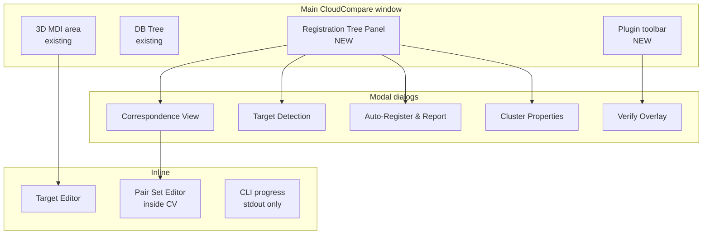

# 04 — UI Pages

> **What does each screen look like, and what does the user do on it?**

This is the wireframe-level spec. Every page in the plugin is documented here with:
- An **ASCII wireframe** (so a UI dev can build it without re-reading this doc)
- The **interactions** on it (what's clickable, what happens)
- The **state** it can be in (loading, empty, error, etc.)
- **Cross-references** to the feature IDs from [`02-features.md`](02-features.md) that it implements

The wireframes use box-drawing characters (─ │ ┌ ┐ └ ┘ ├ ┤ ┬ ┴ ┼). They're approximate; the actual Qt layout will be `QSplitter` + `QTreeWidget` + `QTableWidget` etc., and the visual style follows CloudCompare's existing dock widget conventions (see `AGENTS-ui.md`).

> **If you're an LLM agent about to build this:** build the wireframes first as static UI, then wire up the signals. Don't try to build the wiring against a non-existent layout.

---

## 1. The screen map



---

## 2. The Registration Tree Panel

This is the **persistent UI surface** of the plugin. It's the thing the user opens once and never closes.

### 2.1 The wireframe

```
+--------------------------------------------------------------+
| Registration Tree                                       [X]  |
+--------------------------------------------------------------+
| [+] New cluster  [Detect targets]  [Auto-register v]  [...]  |
+--------------------------------------------------------------+
| v Project                          [Status: REGISTERED]      |
|   v Building                  📍  [Status: REGISTERED]      |
|     v Floor1            🔒 📍  [Status: REGISTERED]          |
|         Scan1                 [RMS: 2.8mm]                   |
|         Scan2                 [RMS: 2.9mm]                   |
|         Scan3                 [RMS: 3.0mm]                   |
|     v Floor2            🔒      [Status: REGISTERED]          |
|         Scan4                 [RMS: 3.2mm]                   |
|         Scan5                 [RMS: 3.1mm]                   |
|         Scan6                 [RMS: 2.7mm]                   |
|   > Garden  (3 scans)          [Status: STALE]               |
|   > House  (5 scans)           [Status: FAILED]              |
|                                                              |
+--------------------------------------------------------------+
| Last operation: Auto-register TDR+C2C on Floor2.            |
| Overall RMS: 3.0mm. Time: 12s.   [View report]  [Undo]      |
+--------------------------------------------------------------+
```

### 2.2 The widget breakdown

| Region | Qt widget | Behaviour |
|---|---|---|
| Title bar | Standard dock title | Drag to undock; "X" hides the panel. |
| Toolbar | `QToolBar` | New cluster, Detect targets, Auto-register (dropdown), More (menu). |
| Tree | `QTreeWidget` | One row per cluster / scan. Expand/collapse. Drag-drop reorders and reparents. |
| Status icons | Inline `QLabel` | 🔒 for locked, 📍 for reference, [Status: X] for registration state. |
| Status bar | `QStatusBar` | Last operation result + View report / Undo. |

### 2.3 The tree row anatomy

```
[indent] [expander] [name (bold if reference)] [🔒] [📍]  [Status: <state>]
```

- **Indent** — depth in the hierarchy.
- **Expander** — triangle for expand/collapse.
- **Name** — cluster or scan name. Bold if reference.
- **🔒** — present if locked. Tooltip on hover: "Locked: internal registration is frozen."
- **📍** — present if reference. Tooltip on hover: "Reference: this cluster is the alignment target for its siblings."
- **Status** — UNREGISTERED / IN_PROGRESS / REGISTERED / STALE / FAILED. Coloured:
  - UNREGISTERED: grey
  - IN_PROGRESS: blue, animated
  - REGISTERED: green
  - STALE: yellow
  - FAILED: red

### 2.4 The toolbar (top)

| Button | Action |
|---|---|
| `+ New cluster` | Create a new empty cluster at the root |
| `Detect targets` | Run target detection on the selected cluster / scan |
| `Auto-register v` | Dropdown: TBR, TDR, C2C, TDR+C2C |
| `[...]` | More menu: Verify overlay, Save pair set, Reset all, etc. |

### 2.5 The status bar (bottom)

Shows the result of the last operation:

```
Last operation: Auto-register TDR+C2C on Floor2.
Overall RMS: 3.0mm. Time: 12s.   [View report]  [Undo]
```

- **Last operation** — what just happened.
- **Overall RMS** — the result.
- **Time** — how long it took.
- **View report** — opens the report dialog (see §5).
- **Undo** — reverts the last commit (single-level undo).

### 2.6 Drag-and-drop

- **Drag a scan onto a cluster** → adds the scan to the cluster.
- **Drag a cluster onto another cluster** → reparents.
- **Drag a cluster onto the root** → unparents (becomes a top-level cluster).
- **Drop targets highlight** with a blue background during drag.
- **Drops into a locked cluster are rejected** with a tooltip: "Cluster is locked. Unlock first to move children."

### 2.7 Right-click context menu

| Menu item | Visible when | Action |
|---|---|---|
| New cluster | Always | Create empty cluster at this level |
| Detect targets | Cluster or scan selected | Run target detection |
| Auto-register → … | Cluster with ≥ 2 children | Submenu: TBR, TDR, C2C, TDR+C2C |
| Manual register | Cluster with 2 children, OR 2 scans | Open correspondence view |
| Lock / Unlock | Cluster | Toggle lock |
| Set as reference / Clear reference | Cluster | Toggle reference |
| Rename | Always | Inline rename |
| Delete | Always (with confirmation) | Delete cluster (and its descendants) |
| Properties… | Always | Open cluster properties dialog (§6) |
| Verify | Cluster | Open verify overlay at this cluster |
| View report | Cluster (if REGISTERED) | Show report dialog |
| Reset registration | Cluster | Clear this cluster's reg state |
| Reset all registration | Root | Clear all reg state (with confirmation) |

### 2.8 State variants

| State | What changes |
|---|---|
| Empty project | Tree is empty. "No clusters yet. Open some scans or right-click here to create a cluster." Hint text. |
| Loading | All rows greyed, animated progress. Tree not interactive. |
| Selected (1 row) | Right-click menu is enabled. Toolbar buttons reflect what's possible. |
| Multi-selected | Right-click → "New cluster from selection". Drag-drop as a group. |
| During auto-register | A modal progress dialog covers the tree. The status bar shows progress text. |

---

## 3. Correspondence View

The dual-viewport dialog. The "register by hand" UI.

### 3.1 The wireframe (default split)

```
+--------------------------------------------------------------+
| Correspondence View — Cluster1 ↔ Scan5              [X] [?]   |
+--------------------------------------------------------------+
| Source:    [v Cluster1 (composite)        ]  Ref: [v Scan5 ] |
| Mode:      ( ) Aligned moves  (o) Reference moves            |
| Up:        [Z (default)  v]   Coarse tol: [10.0m]            |
+--------------------------------------------------------------+
|                              |                               |
|   Viewport A                 |   Viewport B                  |
|   (Source cloud)             |   (Reference cloud)           |
|                              |                               |
|   + A1 ─ ─ ─ ─ ─ ─ ─ ─ ─ ─ ─ ─  + B1                          |
|     [picked in A]              [picked in B]                 |
|                              |                               |
|   + A2                        |   + B2                        |
|     [picked in A]              [picked in B]                 |
|                              |                               |
|   (no A3 yet)                 |   (no B3 yet)                |
|                              |                               |
+--------------------------------------------------------------+
|  # | A (x,y,z)            | B (x,y,z)            | Dist (mm) |
|----+----------------------+----------------------+-----------|
|  1 | 1.234, 5.678, 0.012  | 1.245, 5.690, 0.008  |  18.3  *  |
|  2 | 2.345, 6.789, 0.023  | 2.340, 6.795, 0.025  |   8.1  G  |
|  3 | 3.456, 7.890, 0.034  | 3.462, 7.881, 0.030  |  10.5  G  |
+--------------------------------------------------------------+
|  RMS overall: 12.8mm. Min pairs: 3 (have 3).                 |
|                                                              |
|  [Reset]  [Save pair set]  [Load pair set]                   |
|                                              [Cancel] [Apply]|
+--------------------------------------------------------------+
```

### 3.2 The wireframe (preview active)

```
+--------------------------------------------------------------+
| Correspondence View — Cluster1 ↔ Scan5  [PREVIEW ACTIVE] [X]  |
+--------------------------------------------------------------+
|                              |                               |
|   Viewport A                 |   Viewport B                  |
|   (Source, TRANSFORMED)      |   (Reference, FIXED)          |
|                              |                               |
|   + A1 ─ ─ ─ ─ ─ ─ ─ ─ ─ ─ ─ ─  + B1                          |
|   + A2                        |   + B2                        |
|   + A3 ─ ─ ─ ─ ─ ─ ─ ─ ─ ─ ─ ─  + B3                          |
|                              |                               |
+--------------------------------------------------------------+
|  # | A (x,y,z)            | B (x,y,z)            | Dist (mm) |
|  1 | 1.234, 5.678, 0.012  | 1.245, 5.690, 0.008  |   2.1  G  |
|  2 | 2.345, 6.789, 0.023  | 2.340, 6.795, 0.025  |   1.8  G  |
|  3 | 3.456, 7.890, 0.034  | 3.462, 7.881, 0.030  |   3.2  G  |
+--------------------------------------------------------------+
|  RMS overall: 2.4mm ✓        [Stop preview]                  |
|                                              [Cancel] [Apply]|
+--------------------------------------------------------------+
```

### 3.3 The widget breakdown

| Region | Qt widget | Behaviour |
|---|---|---|
| Title bar | `QDialog` title | Shows source ↔ ref. Preview indicator when active. |
| Top controls | `QFormLayout` | Source / Ref dropdowns, mode radio, up vector, coarse tolerance. |
| Viewport splitter | `QSplitter` horizontal | Holds two `ccGLWindowInterface*` widgets (via `m_app->createGLWindow`). |
| Pair table | `QTableWidget` | 3 columns: # / A / B / Dist. Editable. Per-row colour by residual. |
| Status bar | `QStatusBar` | "RMS overall: X. Min pairs: N (have M)." |
| Bottom buttons | `QDialogButtonBox` | Reset, Save/Load pair set, Cancel, Apply. |
| Preview toggle | `QPushButton` | Becomes "Stop preview" when active. |

### 3.4 The viewport interactions

Each viewport behaves like the standard CloudCompare 3D viewport: pan, rotate, zoom, etc. Plus:

- **Click in viewport A** captures the 3D point and adds a `cc2DLabel` "An" at that point. Same for B → "Bn".
- The mode is implicit: if the user just picked in A, the next pick is expected in B. The status bar shows the current mode.
- Labels are `cc2DLabel` instances added to the **viewport's own db-tree** (not the main db-tree). See [`../../docs/context/registration/dual-viewport.md` §3](../../docs/context/registration/dual-viewport.md).
- Hover on a label shows a tooltip with the exact coordinates.

### 3.5 The pair table

| Column | Editable | Behaviour |
|---|---|---|
| # | No | Auto-numbered. |
| A (x, y, z) | No | Shows the picked point in A. |
| B (x, y, z) | No | Shows the picked point in B. |
| Dist (mm) | No | Distance between A and B after the current transform. |

Per-row colouring: **Green** < 5mm, **Yellow** 5-15mm, **Red** > 15mm. Thresholds configurable in project settings (default 5/15mm).

Row selection highlights the corresponding labels in both viewports. Right-click → "Remove pair", "Move to other viewport" (swaps A and B), "Re-pick this side".

### 3.6 The mode radio

| Mode | Effect |
|---|---|
| Aligned moves | The A cloud is transformed to align to B (the reference). |
| Reference moves | The B cloud is transformed to align to A. |

Either is fine; just lets the user choose which cloud "moves" in their mental model. The math is the same; only the application of the transform changes.

### 3.7 The buttons

| Button | Action |
|---|---|
| Reset | Clear all pairs. Confirmation: "Clear all N pairs?" |
| Save pair set | Save the current pair set to a `.qpairs.json` file. |
| Load pair set | Load a `.qpairs.json` from disk. |
| Preview / Stop preview | Toggle live preview. Disabled until ≥ 3 pairs. |
| Cancel | Discard preview, close dialog. Geometry unchanged. |
| Apply | Commit transform. Updates the cluster's registration state. Closes dialog. |

### 3.8 State variants

| State | What changes |
|---|---|
| < 3 pairs | Apply disabled. Preview disabled. Status bar shows "Need 3 pairs for rigid registration; have N." |
| 3-4 pairs | Apply enabled. Preview enabled. RMS may be unstable; warning shown. |
| ≥ 5 pairs | "Good RMS territory" hint if RMS > 10mm. |
| Preview active | Title shows "[PREVIEW ACTIVE]". Viewport A shows the transformed cloud. Distances in the table are post-transform. |
| Apply with high RMS | Confirmation: "RMS is 12.4mm; recommended < 5mm. Apply anyway?" |

---

## 4. Target Detection Dialog

### 4.1 The wireframe

```
+--------------------------------------------------------------+
| Target Detection                                  [X] [?]   |
+--------------------------------------------------------------+
| Apply to:    [v Cluster1 (8 scans)                v]         |
|                                                              |
| v Spheres                                                     |
|   [x] Detect spheres                                        |
|       Radius:   [70.0] mm    Range: [10] - [300] mm         |
|       Min points: [50]   Confidence: [0.7]                  |
|                                                              |
| v Checkerboards                                              |
|   [ ] Detect checkerboards                                  |
|       Square size: [50.0] mm   Min contrast: [40]           |
|                                                              |
| v Manual markers                                             |
|   [x] Allow user to add manual markers after auto-detect   |
|                                                              |
| Preview in viewport: [x]                                     |
|                                                              |
+--------------------------------------------------------------+
| Detected so far in Scan1: 5 spheres, 0 checkerboards         |
| Detected so far in Scan2: 4 spheres, 0 checkerboards         |
| ...                                                          |
|                                                              |
|                                          [Cancel] [Detect]   |
+--------------------------------------------------------------+
```

### 4.2 The widget breakdown

- **Apply to** — dropdown of all clusters / scans in the project. Default: the currently selected cluster.
- **Spheres** — collapsible section with radius, range, min points, confidence.
- **Checkerboards** — collapsible section with square size, min contrast.
- **Manual markers** — checkbox: "Allow user to add manual markers after auto-detect".
- **Preview in viewport** — checkbox: show detected targets as wireframe spheres / checkerboards in the 3D viewport as they're detected.
- **Detected so far** — running count per scan, updated live.

### 4.3 The Detect button

Runs the configured detection on every scan in the "Apply to" set. Progress bar per scan. On completion, the dialog stays open with the counts updated. User can adjust parameters and re-run.

The targets are stored in the scan's metadata. The user can review / rename / delete them in the **Target Editor** (§7), or close the dialog and proceed to registration.

---

## 5. Auto-Register & Report Dialog

### 5.1 The wireframe (progress)

```
+--------------------------------------------------------------+
| Auto-Register: Cluster1 (TDR + C2C)                [X]       |
+--------------------------------------------------------------+
| Step 1 of 2: Top-view registration                           |
|   [===================>           ] 65%   4 of 6 pairs        |
|                                                              |
|   Pair 5/6: Scan5 → Scan6                                    |
|   RMS so far: 4.2mm                                          |
+--------------------------------------------------------------+
| [Cancel]                                                     |
+--------------------------------------------------------------+
```

### 5.2 The wireframe (report)

```
+--------------------------------------------------------------+
| Registration Report — Cluster1                        [X] [?]|
+--------------------------------------------------------------+
| Mode: TDR + C2C     Date: 2026-08-18 22:14:33   Time: 12.4s  |
| Overall RMS: 3.2mm                                           |
|                                                              |
|  v Per-pair (click row to inspect)                           |
|    Pair       Mode    Targets/Matches    RMS (mm)            |
|    Scan1-Scan2  TDR+C2C  4          2.8                       |
|    Scan1-Scan3  TDR+C2C  3          3.4                       |
|    Scan2-Scan3  TDR+C2C  4          3.0                       |
|    Scan3-Scan4  TDR+C2C  3          3.6                       |
|    Scan4-Scan5  TDR+C2C  4          2.9                       |
|    Scan5-Scan6  TDR+C2C  3          3.5                       |
|                                                              |
|  v Outliers                                                  |
|    (none)                                                    |
|                                                              |
|  v Transforms                                                |
|    Scan1: identity                                           |
|    Scan2: T(0.012, 0.005, -0.003) R(0.001, 0.002, 0.001)    |
|    Scan3: T(...) R(...)                                      |
|    ...                                                       |
|                                                              |
+--------------------------------------------------------------+
| [Save as JSON...]  [Open in verify overlay]   [Close]        |
+--------------------------------------------------------------+
```

### 5.3 The widget breakdown

- **Header** — mode, date, duration, overall RMS.
- **Per-pair table** — sortable. Click a row to highlight the corresponding pair in the 3D viewport (existing CloudCompare selection feature).
- **Outliers** — list of pairs / targets that were rejected during the fit.
- **Transforms** — full transform list per scan. User can copy a specific row as JSON.
- **Save as JSON** — save this report to a file.
- **Open in verify overlay** — open the verify overlay (see §6) at this cluster, focused on the worst pair.

### 5.4 The "Open in verify overlay" deep-link

This is a key UX feature. After a registration, the user almost always wants to verify. Instead of "Report closes → user opens verify → user re-navigates to the bad pair", we offer a one-click deep-link: open the verify overlay already focused on the worst pair, with a clipping box already positioned around it.

The deep-link is implemented as a constructor argument: `VerifyOverlay(cluster, focusPair=worstPair)`.

---

## 6. Verify Overlay

### 6.1 The wireframe

```
+--------------------------------------------------------------+
| Verify Overlay — Cluster1                            [X] [?]|
+--------------------------------------------------------------+
| Render mode: ( ) Default  (o) Unique by scan  ( ) Unique by cluster |
| Show targets: [x] spheres  [x] checkerboards  [x] manual     |
|                                                              |
| Clipping boxes:                                              |
|   [x] Box 1: 0.5 x 0.5 x 0.5m at (1.2, 5.6, 0.0)            |
|   [x] Box 2: 1.0 x 1.0 x 1.0m at (3.4, 7.8, 0.0)            |
|   [ ] Box 3: 0.3 x 0.3 x 0.3m at (0.0, 0.0, 0.0)            |
|                                                              |
|   [+ Add box]                                                |
|                                                              |
| Measurements:                                                |
|   Pick a point in scan A, then a point in scan B.           |
|                                                              |
| Distance tool: [Click to measure]                            |
|   Last: 4.2mm (Scan3 → Scan5)                               |
+--------------------------------------------------------------+
```

### 6.2 The widget breakdown

- **Render mode** — radio for Default / Unique by scan / Unique by cluster. Triggers re-render.
- **Show targets** — checkboxes for which target types to render.
- **Clipping boxes** — list of clipping boxes with their position and size. Each is togglable. "+ Add box" creates a new one (the user positions it in the 3D viewport).
- **Distance tool** — click-to-measure. Two clicks → distance in mm.

### 6.3 The unique-by-scan / unique-by-cluster render mode

This is the most important verify feature. Implementation:

```cpp
// pseudo-code
void setUniqueColorMode(ccHObject* root, UniqueColorMode mode) {
    QColor palette = categoricalPalette();  // 12-colour ColorBrewer Set1
    if (mode == UniqueByScan) {
        for each scan in tree: scan->setColorByIndex(scanIndex % palette.size());
    } else {
        for each cluster in tree:
            for each scan in cluster:
                scan->setColorByIndex(clusterIndex % palette.size());
    }
    redrawAllViewports();
}
```

The 12-colour palette (ColorBrewer "Set1") is designed for categorical data and is colour-blind-friendly:

```
[ #E41A1C, #377EB8, #4DAF4A, #984EA3, #FF7F00, #FFFF33,
  #A65628, #F781BF, #1B9E77, #D95F02, #7570B3, #E7298A ]
```

---

## 7. Target Editor and Cluster Properties (compact)

Two small dialogs round out the plugin. They're light enough to share a section.

**Target Editor** is a single-table dialog showing all detected / manual targets in a scan: name, type, position, edit / delete actions. Defaults: `Sphere_NN`, `Checker_NN`, `Manual_NN`, `Plane_NN`. "+ Add manual marker" adds a new one at (0, 0, 0) and prompts the user to pick the position in the viewport.

**Cluster Properties** dialog shows: name (editable), lock checkbox, reference checkbox (with auto-uncheck of other siblings), status (current state, last registration time, last RMS, last mode), children list with per-row RMS, and links to "View report" and "View transforms". The dialog is mostly a read-out — the actual lock / reference toggles can be done in the registration tree's context menu (§2.7) without opening the dialog.

---

## 9. CLI Progress (stdout, not GUI)

The CLI mode has no GUI. Progress is printed to stdout. The user is in PowerShell / bash.

### 9.1 The output format

```
[2026-08-18 22:14:33] qRegistration CLI v1.0
[2026-08-18 22:14:33] Project: C:/jobs/job1.json
[2026-08-18 22:14:33] Output:   C:/jobs/job1_registered.bin
[2026-08-18 22:14:33] Mode:     TBR
[2026-08-18 22:14:34] Loading 8 scans...
[2026-08-18 22:14:36] Loaded. 12.4M points total.
[2026-08-18 22:14:36] Detecting targets (spheres, r=70mm)...
[2026-08-18 22:14:38] Detected 36 targets (4.5 avg per scan).
[2026-08-18 22:14:38] Matching targets by name...
[2026-08-18 22:14:38] Matched 30 target pairs across 7 scan pairs.
[2026-08-18 22:14:38] Fitting rigid transforms...
[2026-08-18 22:14:40] Pair 1/7: Scan1-Scan2, RMS 2.8mm
[2026-08-18 22:14:41] Pair 2/7: Scan1-Scan3, RMS 3.4mm
[2026-08-18 22:14:42] Pair 3/7: Scan2-Scan3, RMS 3.0mm
[2026-08-18 22:14:43] Pair 4/7: Scan3-Scan4, RMS 3.6mm
[2026-08-18 22:14:44] Pair 5/7: Scan4-Scan5, RMS 2.9mm
[2026-08-18 22:14:45] Pair 6/7: Scan5-Scan6, RMS 3.5mm
[2026-08-18 22:14:46] Pair 7/7: Scan6-Scan7, RMS 2.7mm
[2026-08-18 22:14:46] Overall RMS: 3.1mm
[2026-08-18 22:14:47] Committing transforms to C:/jobs/job1_registered.bin...
[2026-08-18 22:14:48] Done. Report saved to C:/jobs/job1_report.json.
[2026-08-18 22:14:48] Exit 0.
```

### 9.2 Verbose mode

`-VERBOSE` adds per-iteration ICP progress, per-target residuals, etc. Default is summary only.

### 9.3 Failure

```
[2026-08-18 22:14:46] Pair 4/7: Scan3-Scan4, FAILED
[2026-08-18 22:14:46]   Reason: ICP diverged (RMS increased over 3 iterations)
[2026-08-18 22:14:46]   Suggestion: Run TDR first, or pick manual point pairs
[2026-08-18 22:14:48] 1 of 7 pairs failed. Cluster marked STALE.
[2026-08-18 22:14:48] Done with errors. Report saved.
[2026-08-18 22:14:48] Exit 1.
```

---

## 10. Style conventions (UI consistency)

Follow the existing CloudCompare conventions: use the `ccColorScaleButton` / `ccColorScalesManager` palette; follow the `ccOverlayDialog` pattern for modals; use `ccGui::ParamStruct` for user preferences; use the existing `:/CC/plugin/qRegistration/icons/` resource set; use red = error / yellow = warning / green = good / blue = in-progress for status colours; right-click context menu on every selectable tree row; confirm all destructive actions; don't fight existing keyboard shortcuts (Ctrl+S, Ctrl+Z, etc.).

---

## 11. Accessibility

Keyboard-only flow, screen reader labels (tooltips everywhere), high-contrast mode via Qt palette, visible focus rings. See the keyboard table in [`03-user-workflows.md` §12](03-user-workflows.md#12-the-keyboard--mouse--menu-surface-one-table).

---

## 12. The pages we explicitly do NOT need

❌ A separate "project management" page (existing File menu is enough). ❌ A separate "scanner integration" page (out of scope). ❌ A separate "report builder" page (JSON export + pandoc is enough). ❌ A "settings" page beyond the existing `ccGui::ParamStruct` preferences.

---

## 13. Pointers

- **The user journeys that hit these pages** — [`03-user-workflows.md`](03-user-workflows.md)
- **The error patterns on these pages** — [`05-ux-patterns.md`](05-ux-patterns.md)
- **The Qt widgets and code paths** — [`06-architecture-and-api.md`](06-architecture-and-api.md)
