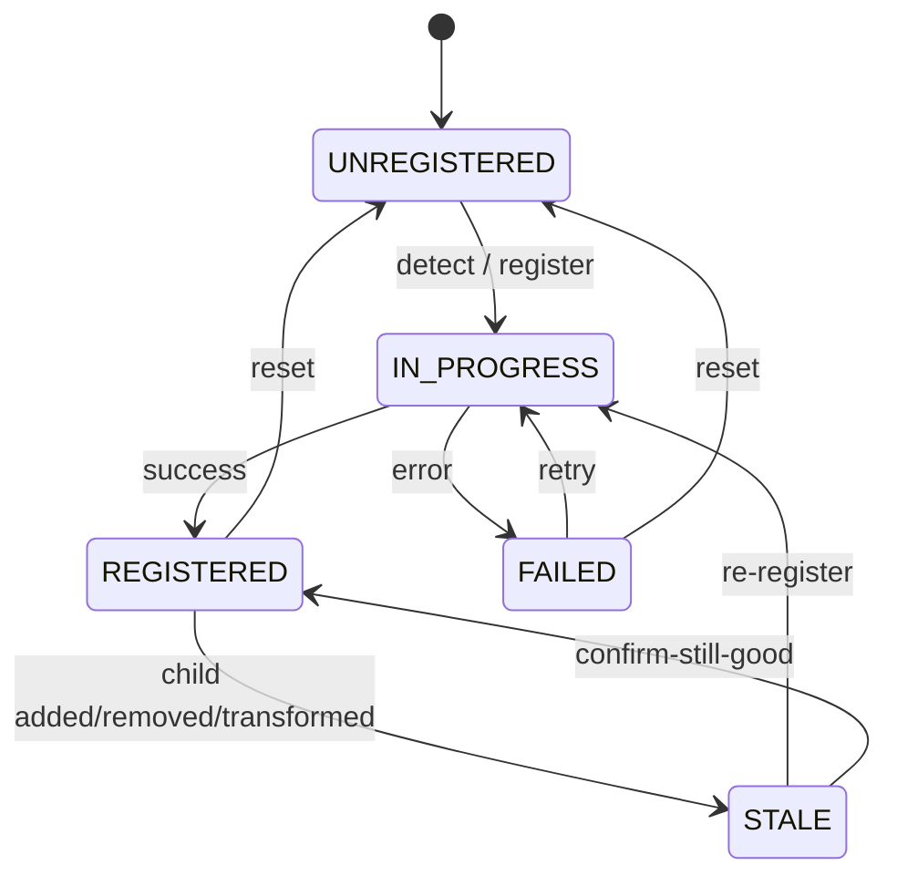

# 05 — UX Patterns

> **How do error states, edge cases, and ambiguous moments actually feel to the user?**

This document is the contract between the wireframes in [`04-ui-pages.md`](04-ui-pages.md) and the human sitting in front of them. It is not about *what* is on screen — that's in §04. It is about *how the screen reacts* when things go right, wrong, or sideways.

The audience is UX, dev, and QA. Every pattern here is testable: a QA engineer should be able to follow the pattern spec to reproduce a real interaction.

---

## 1. The eight UX principles for this plugin

These are the values that drive every interaction. When in doubt, fall back to these.

1. **No silent actions.** Every registration commit shows a report. Every target detection shows what was found. Every lock / unlock changes an icon. If the user can't see what changed, the plugin failed.
2. **Errors are sentences, not codes.** "Scans too far apart for ICP" not "E_ICP_DIVERGED". Codes are for the log file; the user gets a sentence and a suggestion.
3. **Destructive actions confirm.** Delete, reset, unlock-then-discard — all confirm with a dialog that names the specific thing being lost.
4. **The user can always undo the last thing.** Single-level undo on registration commit. Multi-level is v3, but the **last** thing is always undoable.
5. **The status bar is honest.** It says what the plugin is doing right now, not what it was doing 5 minutes ago.
6. **Lock is a hard wall, not a hint.** Locked means locked. No "are you sure you want to ignore the lock?" escape hatch. If the user wants to bypass, they unlock first.
7. **Defaults are surveyor-grade.** RMS thresholds default to 5mm. ICP iterations default to 50. Sphere radius defaults to 70mm. The user can change them; they shouldn't have to.
8. **The plugin does not hide CloudCompare.** The verify overlay, the 3D viewports, the db-tree — they're existing CloudCompare features. The plugin adds; it doesn't replace.

---

## 2. The three states of a registration

Every cluster's registration state is one of:

| State | User-visible cue | What the user can do |
|---|---|---|
| **UNREGISTERED** | Grey status, no RMS shown | Detect targets, register |
| **IN_PROGRESS** | Blue animated status | Cancel |
| **REGISTERED** | Green status, RMS shown | Re-register, lock, view report |
| **STALE** | Yellow status, "children changed" tooltip | Re-register, confirm-still-good |
| **FAILED** | Red status, error reason shown | Reset, retry with different mode |

The transitions:



The "confirm-still-good" transition is important. Sometimes the user *intends* a child change (e.g. manually moving a scan to a slightly different position) and doesn't want to re-register. They can right-click the cluster → "Mark as still good" and the status flips back to REGISTERED.

---

## 3. Tension

**Tension** is a registration where the constraints can't be satisfied and the user can see the result drifting. It's the most common silent failure in any registration software, and it's what makes surveyors paranoid.

### 3.1 What tension looks like

- You have 4 scans registered together. 3 are tightly aligned. The 4th is off by 2cm.
- The pair table in the report shows 3 pairs with RMS 2mm, 1 pair with RMS 18mm.
- The 4th scan is the "bad" one — the constraint conflicts.
- The plugin reports overall RMS 8mm, which is over the threshold. The user knows something's wrong but the report doesn't say *what*.

### 3.2 The plugin's tension response

1. **Per-pair residual** is shown, not just overall. The user sees the bad pair in red.
2. **Per-scan residual** is computed (each scan's avg residual across pairs it's in) and shown. The bad scan is highlighted in the registration tree.
3. **The auto-register refuses to commit** if the worst pair exceeds 3× the median pair RMS, with a clear message: "Pair Scan3-Scan4 has residual 18mm; median is 3mm. This may indicate a mis-match. Review before committing."
4. **Force correspondences** is the user's escape hatch: lock the good pairs, force the bad pair to re-search. (This is a SCENE pattern.)

### 3.3 The UX of tension

The user should feel "the plugin is being honest with me, even when I might be wrong". The plugin doesn't paper over bad data; it surfaces it. The auto-confirm dialog at high RMS is critical:

```
RMS is 18.4mm. Recommended < 5mm.

Common causes:
  - One or more point pairs are mismatched (re-pick the worst)
  - The two clouds have different scale (rigid only, scale not supported)
  - The two clouds are not the same scene (different scan jobs)

[ Cancel ]   [ Re-pick worst pair ]   [ Apply anyway ]
```

Three buttons, not two. The middle one is the most useful: it identifies the worst pair and pre-selects it in the table for the user to re-pick.

---

## 4. Scale mismatch

The single most common silent failure. Two clouds are in different units (mm vs m) or different coordinate systems (e.g. one is in scanner-native, the other is in survey-control coords).

### 4.1 Detection

When the user picks the first 3 pairs and clicks Preview, the plugin checks:

- **Centroid distance** — if the two centroids are > 1000m apart, almost certainly different coordinate systems. (Or a really big site, but 1000m is the soft threshold.)
- **Bounding box ratio** — if one cloud's bbox is 1000x bigger than the other's, almost certainly different scale.

### 4.2 Response

A modal dialog:

```
This registration may have a scale mismatch.

Cloud A: ~12.4m extent, centroid at (0, 0, 0)
Cloud B: ~12400m extent, centroid at (5000, 0, 0)

This usually means:
  - Different unit systems (m vs mm)
  - Different coordinate systems (local vs global)

Rigid registration cannot align clouds at different scales.
v1 does not support scale-aware registration.

[ Cancel ]   [ Continue anyway (expect bad result) ]
```

Two buttons. "Continue anyway" is allowed but the report RMS will be massive; the user will see the bad result and the next registration attempt should be set up correctly.

### 4.3 The prevention pattern

The plugin doesn't *prevent* scale mismatch (the user might have intentionally loaded two differently-scaled clouds). But it **detects early** and tells the user, so they don't waste 10 minutes on a registration that was doomed from the start.

---

## 5. The "lock + reference" UX

This is the killer feature. The UX has to make it obvious and unforgeable.

### 5.1 Visual model

- 🔒 = "I am frozen; do not touch me."
- 📍 = "I am the alignment target for my siblings."
- A cluster with both = "I am the anchor for this group; my siblings have already been registered to me and we don't want to disturb that."

### 5.2 The "set as reference" feedback

When the user right-clicks Floor1 → "Set as reference", the system:

1. Sets Floor1 to reference.
2. **Auto-clears** reference on any other sibling (Floor2). With a toast: "Reference set to Floor1. Cleared reference on Floor2."
3. Re-renders the tree with the new icons.

This is the SCENE behaviour. We match it.

### 5.3 The "register children" feedback

When the user right-clicks Building → "Register children":

1. **Pre-check**: the system verifies there's a reference cluster. If not, the error dialog from §3 of [`03-user-workflows.md`](03-user-workflows.md#3-workflow-3--i-have-2-sub-clusters-of-3-scans-each-register-them-together) appears.
2. **Pre-check 2**: the system verifies all siblings are locked (or at least the reference is locked — the SCENE pattern is "lock both, then register"). If they're not, a softer dialog: "Floor1 is reference but unlocked. Lock both clusters for best results. Continue anyway?"
3. **Run registration** between siblings. The reference stays fixed; non-reference siblings move.
4. **Show the report** with per-sibling residuals. The user can see that the reference's RMS is 0 (it's not moving) and the moving siblings' RMS is their actual error.

### 5.4 The "I want to un-lock and re-do" feedback

The user un-locks Floor1. The status bar of Floor1 immediately says "⚠ This cluster is no longer locked. The parent Building's registration may be stale." The parent's status flips to STALE (yellow). The user is told.

---

## 6. Empty states

Every page that can be empty has a "what now?" moment. The patterns:

### 6.1 Empty project

The registration tree shows:

```
+------------------------------------------------+
|  Registration Tree                        [X]  |
+------------------------------------------------+
|  [+] New cluster   [Detect targets]   [Auto v] |
+------------------------------------------------+
|                                                |
|         (empty)                                |
|                                                |
|  No clusters yet.                              |
|  Open some scans, or right-click here          |
|  to create a cluster.                          |
|                                                |
+------------------------------------------------+
```

A hint, not an error. The user knows what to do.

### 6.2 Empty cluster

A cluster with no children:

```
v Cluster2
  (empty)
  [Drop scans here, or right-click to add]
```

The user can drop scans into the cluster, or right-click → "Add scans" to pick from the db-tree.

### 6.3 Empty correspondence view

When the user opens Correspondence View with 0 pairs:

```
Status bar: "Need 3 pairs for rigid registration; have 0."

[Preview] [Apply] buttons greyed out.
```

### 6.4 No targets detected

After running target detection with 0 hits:

```
Detected so far in Scan1: 0 spheres, 0 checkerboards.
Reason: no spherical geometry found in the configured radius range.

Suggestions:
  - Increase the radius range
  - Use manual markers instead
  - Try cloud-to-cloud registration
```

---

## 7. Loading states

Long operations show progress. The patterns:

### 7.1 Indefinite (target detection on a big scan)

```
Detecting spheres in Scan1...
[============>     ] 60%  (searching 3 of 5 octree levels)
```

### 7.2 Definite (registration with known pair count)

```
Registering Cluster1 (TDR + C2C)...
Step 1 of 2: Top-view registration
[==============>     ] 65%  Pair 4 of 6
```

### 7.3 Cancel-friendly

Every long operation has a Cancel button. The cancellation is graceful:

- ICP: stop at the next iteration, save the partial result, return it as IN_PROGRESS.
- Target detection: stop at the next scan, return what was found so far.
- Save / load: finish the current write, then stop.

Cancellation never leaves the system in an undefined state.

---

## 8. Confirmation patterns

Destructive actions get confirmation. The default button is always **Cancel** (existing CloudCompare convention).

| Action | Confirmation message |
|---|---|
| Delete cluster | "Delete 'Floor1' and its 3 scans? This cannot be undone." |
| Reset all registration | "Clear all cluster registration state? Scan geometry unchanged; lock + reference flags lost; reports archived to _reports/_archive_<ts>/." |
| Unlock a locked cluster | "Unlock 'Floor1'? Internal registration can be modified. If a parent is registered to this cluster, that registration will be marked stale." |
| Discard pair set | "Discard all 6 picked pairs? This cannot be undone." |
| Apply with high RMS | "RMS is 12.4mm; recommended < 5mm. Apply anyway?" |
| Continue with scale mismatch | (see §4.2) |
| Force re-register | "Re-detect target correspondences for Cluster1? May produce different matches than the current ones." |
| Reset parent registration | "Reset 'Building' registration? Floor1 + Floor2 keep internal registration; relative pose cleared." |

---

## 9. The "I'm stuck" patterns

When the user has tried everything and the registration is still bad:

### 9.1 The "stuck" indicator

After 3 failed registration attempts on the same cluster, the status bar shows a hint:

```
⚠ Cluster1 has failed 3 registrations. Common causes:
  - Targets are mismatched (re-run with "Force correspondences" off)
  - Scans are too far apart (run TDR first, or pick manual pairs)
  - Scene has low overlap (try cloud-to-cloud with broader search)
```

### 9.2 The "try another mode" button

In the same hint, a button: [Try another mode]. Clicking it opens the auto-register dropdown with all modes listed, and the user can try TBR / TDR / C2C / TDR+C2C.

### 9.3 The "open correspondence view" button

In the same hint, another button: [Pick manual pairs]. Clicking it opens the correspondence view directly.

---

## 10. The undo UX

### 10.1 What undo does

The Undo button on the status bar reverts the **last registration commit**. Specifically:

- The cluster's transform is reset to its pre-commit pose.
- The cluster's status is set back to UNREGISTERED.
- The pair table / target set is unchanged (the user can re-run the registration).

### 10.2 What undo does NOT do

- It does not undo target detection. (Detected targets are inputs to registration, not commits.)
- It does not undo lock / unlock. (These are metadata, not commits.)
- It does not undo changes to the cluster hierarchy. (Adding/removing children is not a commit.)
- It does not undo a registration in a child cluster. (That's a different cluster's commit.)

### 10.3 The "undo" tooltip

```
Undo last commit (Ctrl+Z)

Reverts the last registration commit on this cluster.
The pair table, target set, and cluster structure are unchanged.
The cluster's status returns to UNREGISTERED.
```

This is what the user sees. No surprises.

---

## 11. The "save" UX

### 11.1 What "Save" means

File → Save (Ctrl+S) saves:

- The geometry to the `.bin` (existing behaviour).
- The registration state to the `.qreg.json` sidecar (new).
- Any unsaved pair sets to their files (if the user has a pair set loaded).

The user sees a brief status bar message: "Saved: project.bin (12.4M points), project.qreg.json (8 clusters, 3 reports)."

### 11.2 What "Save As" does

Standard. Choose a new file path; the old files are not modified.

### 11.3 What "Export Project" does

Exports just the `.qreg.json` (without the `.bin`). Used to share a registration state with a collaborator who has the same `.bin`.

### 11.4 What "Import Project" does

Imports a `.qreg.json` and applies its registration state to the currently loaded project. Used when the user has a `.bin` from a collaborator and a separate `.qreg.json`.

The import flow has a confirmation: "Apply 3 clusters, 8 lock flags, 2 reports from project.qreg.json to the current project? Existing registration state will be replaced."

---

## 12. Notifications (toast / status bar / dialog)

Three channels, used appropriately:

| Channel | When | Example |
|---|---|---|
| **Toast** (transient banner, 3-second auto-dismiss) | Informational, non-blocking | "Reference set to Floor1. Cleared reference on Floor2." |
| **Status bar** (persistent text at the bottom of the registration tree panel) | The current state of the plugin | "Detecting targets in Scan1... 60%." |
| **Modal dialog** | The user must make a decision | "RMS is 12.4mm. Apply anyway?" |

No exceptions. Toasts don't get used for "this requires your decision". Status bar doesn't get used for "this just succeeded, click to view". Modal dialogs don't get used for "FYI".

---

## 13. Internationalisation

The plugin uses Qt's `tr()` for all user-visible strings, following the existing CloudCompare model. The string catalog (`qRegistration_xx.ts`) is generated by `lupdate`; translations are community-contributed.

**Translated:** all labels, tooltips, status messages, error messages, suggested-action sentences.
**Not translated:** numeric values, file paths, internal class/type names (in error stacks), the plugin's own name (`qRegistration`).

---

## 14. The "feels fast" patterns

About perceived performance. The math doesn't change, but the user feels like the plugin is snappy.

| Pattern | Where |
|---|---|
| **Pre-compute on selection change** | When the user selects a cluster, pre-compute centroid and bbox so the next register is instant. |
| **Show progress early** | Even for a 1-second operation, show a brief "Computing..." status. |
| **Reuse the report view** | Re-use the open report dialog; don't open a new one. |
| **Cancel-friendly iteration** | Let the user cancel a long registration, fix one thing, re-run. |
| **LRU cache for pair sets** | Cache pair sets in memory; the second open is instant. |

## 15. The "doesn't fit" patterns

The plugin explicitly does NOT do:

- ❌ Tutorial overlay on first launch (tooltips exist; the README is the tutorial).
- ❌ Badges / achievements / gamification (surveyors are professionals).
- ❌ Social features (no sharing, no leaderboards).
- ❌ Dark patterns (we don't have a Pro to upsell).
- ❌ Auto-update nags (OSS; users get the version their distro / fork ships).

## 16. Pointers

- **The screens** — [`04-ui-pages.md`](04-ui-pages.md)
- **The features** — [`02-features.md`](02-features.md)
- **The workflows** — [`03-user-workflows.md`](03-user-workflows.md)
- **The architecture** — [`06-architecture-and-api.md`](06-architecture-and-api.md)
