# 07 — Roadmap

> **What did we cut from v1, when does it come back, and why is it deferred rather than shipped?**

This is the document that makes the v1 scope honest. Every feature in [`02-features.md`](02-features.md) is either **in v1** or **deferred to a later version**. There is no third bucket. The reasons for deferral are explicit.

The roadmap is committed but the dates are not. v1 ships when it's done; v2 starts when v1 is stable. We're a one-dev shop; we don't commit to release dates.

---

## 1. The version timeline

```
v1.0 (this PRD)              ── The MVP: cluster model, lock + reference,
                                   TBR / TDR / C2C, manual point-pair,
                                   target detection, verify, save/load, CLI.

v1.1 — bug fixes             ── First ~3 months post-v1. Ship what users hit.

v1.2 — polish                ── UI affordances the v1 wireframes don't have.
                                   Multi-resolution ICP. Save/load forward
                                   compat across patch versions.

v2.0 — the "I almost moved from SCENE" release
                              ── Hybrid registration, plane-based, N-viewport
                                   correspondence, PDF reports, batch UI,
                                   Interactive Registration graph editor,
                                   multi-level undo, synchronized camera views,
                                   texture-aware picking.

v3.0 — the "I actually moved from SCENE" release
                              ── On-site / real-time registration, VR view,
                                   WebShare-equivalent cloud sharing,
                                   scanner integration (vendor SDKs).
```

---

## 2. The deferred features (with rationale)

Each deferred feature has:
- The original feature ID from [`02-features.md`](02-features.md) (or a new ID if it was never specced there).
- The target version.
- The reason for deferral.
- The rough effort estimate.
- The dependency (does it block other deferred features?).

### 2.1 v2 candidates (in priority order)

| ID | Feature | Why deferred | Effort | Blocks |
|---|---|---|---|---|
| **DF-01** | **Hybrid registration** (TBR + survey control + C2C in one pass) | Requires survey-control subsystem (DF-02) plus changes to all 3 existing registration modes. Ship after survey control lands. | 3 weeks | — |
| **DF-02** | **Survey control / geo-referencing** (import `.csv` / `.cor` of known control points; tie the registered project to a global coordinate system) | Independent subsystem; needs its own UI, persistence, and verify workflow. Big enough to be its own PRD section. | 6 weeks | DF-01 |
| **DF-03** | **Plane-based registration** (register two clouds by matching detected planes) | Requires plane detection pipeline (different from sphere/checkerboard). Algorithm choice (RANSAC + ICP on plane normals) needs research. | 4 weeks | — |
| **DF-04** | **N-viewport correspondence view** (pick pairs across N > 2 clouds) | UX is non-trivial (which pair is "aligned"? all? one reference + N-1 aligned?). Builds on v1's 2-viewport. | 3 weeks | — |
| **DF-05** | **PDF registration reports** | v1 ships JSON. PDF needs a renderer (wkhtmltopdf, or roll-your-own with a small lib). Many surveyors want PDF for clients. | 1 week (with lib) | — |
| **DF-06** | **Batch processing UI** (graphical job runner, not just CLI) | v1's CLI covers the 80%. The UI is a nice-to-have for non-technical users. | 4 weeks | — |
| **DF-07** | **Interactive Registration graph editor** (SCENE 2023.1's link-graph view) | The killer SCENE 2023.1+ feature. Builds on the lock + reference model. Big UX effort. | 8 weeks | — |
| **DF-08** | **Multi-level undo** (stack of 10+ operations) | CloudCompare doesn't have a general undo stack. v1 has single-level. The general undo requires a core change. | 4 weeks + core | — |
| **DF-09** | **Synchronized camera views** (pan/rotate one viewport, others follow) | Useful but not essential. The `ccGLWindow` API doesn't support it; we have to wire it ourselves. | 2 weeks | — |
| **DF-10** | **Texture / colour-aware picking** (pick a point in viewport A, the plugin suggests the most-colour-similar point in viewport B) | Adds complexity to the picking listener. Useful for scans with rich colour but not for surveys. | 3 weeks | — |
| **DF-11** | **Multi-resolution ICP** (subsample to 50%, 25%, 12% and run ICP at each level) | v1 has the single-res version. Multi-res is a 2-line change in the ICP wrapper. | 0.5 week | — |
| **DF-12** | **Moveable "register in this order" hints** in the cluster tree | Re-uses the existing drag-reorder feature; just adds an explicit "registration order" mode. | 1 week | — |
| **DF-13** | **Export pair sets as CSV** (for sharing with colleagues) | Trivial. Spreadsheet-friendly. | 0.5 week | — |
| **DF-14** | **"Reset all" archive** (a "Restore" command that pulls from the archive folder) | v1 archives on reset; doesn't restore. v2 adds the restore. | 1 week | — |
| **DF-15** | **Diff vs disk** (show what's changed since last save) | Useful for paranoid users. Builds on the state machine. | 2 weeks | — |
| **DF-16** | **Group selection of clusters** (multi-select for batch operations) | v1 has single-row context menus. v2 adds shift-click / ctrl-click multi-select. | 2 weeks | — |

### 2.2 v3 candidates (in priority order)

| ID | Feature | Why v3 | Effort |
|---|---|---|---|
| **DF-20** | On-site / real-time registration | Vendor SDK; NDA-only | 12+ wks |
| **DF-21** | VR view | OpenXR / SteamVR; separate platform | 8 wks |
| **DF-22** | WebShare-equivalent cloud sharing | Cloud infra; wrong model for Icelabz | 12+ wks |
| **DF-23** | Scanner SDK integration | NDA + vendor-driver fragility | 12+ wks/vendor |
| **DF-24** | On-site scanner compensation | Firmware-level; vendor-locked | 8 wks |
| **DF-25** | Moving-objects filter | ML; SCENE's is proprietary | 12+ wks |
| **DF-26** | Geo-referencing of the project | Global ellipsoid (WGS84); depends on DF-02 | 6 wks |
| **DF-27** | Cross-project registration | Needs "projects" container | 8 wks |

### 2.3 What we will NEVER build (explicitly)

These are the features we'd decline if asked. They're outside the plugin's charter.

| Feature | Why no |
|---|---|
| **A web-based registration service** | Different product. The plugin is a desktop tool. |
| **A mobile / iPad registration app** | Different product. CloudCompare is desktop. |
| **A Revit / AutoCAD plugin for direct registration output** | Different product. The user can export `.rcp` / `.rcs` after registration. |
| **A scanner-driver toolkit** | Vendor-locked; NDA; not our job. |
| **An AI-driven automatic target detector** | "AI" hype; the user can already do it with the right radius. Real AI would need a labelled training set we don't have. |
| **A general-purpose point cloud editor** | CloudCompare already is one. We register; it edits. |

---

## 3. Feature parity matrix vs Faro SCENE Classic

For the record, this is what the plugin will and won't match against SCENE.

| SCENE feature | v1 | v2 | v3 | Never |
|---|---|---|---|---|
| Cluster hierarchy | ✅ | — | — | — |
| Lock cluster | ✅ | — | — | — |
| Reference cluster | ✅ | — | — | — |
| Target-based registration (TBR) | ✅ | — | — | — |
| Top-view registration (TDR) | ✅ | — | — | — |
| Cloud-to-cloud (C2C) | ✅ | — | — | — |
| TDR + C2C combined | ✅ | — | — | — |
| Sphere target detection | ✅ | — | — | — |
| Checkerboard target detection | ✅ | — | — | — |
| Manual markers | ✅ | — | — | — |
| Correspondence view (2-viewport) | ✅ | — | — | — |
| RMS per pair + overall | ✅ | — | — | — |
| JSON registration report | ✅ | — | — | — |
| Save / load registration state | ✅ | — | — | — |
| CLI mode | ✅ | — | — | — |
| Single-level undo | ✅ | — | — | — |
| Verify overlay | ✅ | — | — | — |
| Unique colour by scan / cluster | ✅ | — | — | — |
| **Hybrid registration** | — | DF-01 | — | — |
| **Survey control / geo-referencing** | — | DF-02 | — | — |
| **Plane-based registration** | — | DF-03 | — | — |
| **N-viewport correspondence** | — | DF-04 | — | — |
| **PDF reports** | — | DF-05 | — | — |
| **Batch processing UI** | — | DF-06 | — | — |
| **Interactive Registration (graph)** | — | DF-07 | — | — |
| **Multi-level undo** | — | DF-08 | — | — |
| **Synchronized cameras** | — | DF-09 | — | — |
| **Texture / colour-aware picking** | — | DF-10 | — | — |
| **Multi-resolution ICP** | — | DF-11 | — | — |
| **On-site / real-time registration** | — | — | DF-20 | — |
| **VR view** | — | — | DF-21 | — |
| **WebShare cloud sharing** | — | — | DF-22 | — |
| **Scanner SDK integration** | — | — | DF-23 | — |
| **On-site compensation** | — | — | DF-24 | — |
| **Moving-objects filter** | — | — | DF-25 | — |
| **Cross-project registration** | — | — | DF-27 | — |
| **Web-based service** | — | — | — | Never |
| **Mobile app** | — | — | — | Never |
| **AI target detector** | — | — | — | Never |

---

## 4. The dependency graph for v2

```mermaid
flowchart TB
    V2[v2.0 start] --> DF11[DF-11: Multi-res ICP]
    V2 --> DF13[DF-13: Export pair sets as CSV]
    V2 --> DF14[DF-14: Reset all restore]
    V2 --> DF05[DF-05: PDF reports]
    V2 --> DF09[DF-09: Synchronized cameras]
    V2 --> DF03[DF-03: Plane-based registration]
    V2 --> DF12[DF-12: Registration order hints]
    V2 --> DF15[DF-15: Diff vs disk]
    V2 --> DF04[DF-04: N-viewport correspondence]
    V2 --> DF16[DF-16: Group selection]
    V2 --> DF10[DF-10: Texture-aware picking]
    V2 --> DF06[DF-06: Batch processing UI]
    V2 --> DF07[DF-07: Interactive Registration graph]
    V2 --> DF02[DF-02: Survey control]
    DF02 --> DF01[DF-01: Hybrid registration]
    DF08[DF-08: Multi-level undo]
    DF08 -.needs core.-> Core[ccUndoStack core change]
```



**Implementation order (rough):**

1. **DF-11** (multi-res ICP) — smallest, polish.
2. **DF-13** (CSV export) — trivial.
3. **DF-14** (reset restore) — small.
4. **DF-05** (PDF reports) — needs a renderer, but isolated.
5. **DF-09** (synced cameras) — UX.
6. **DF-03** (plane-based) — algorithm.
7. **DF-04** (N-viewport) — UX.
8. **DF-06** (batch UI) — bigger surface.
9. **DF-07** (Interactive Registration) — the big v2 feature.
10. **DF-02** (survey control) — bigger surface, new file formats.
11. **DF-01** (hybrid) — depends on DF-02.
12. **DF-08** (multi-level undo) — depends on a core change.

---

## 5. The "if the user requests X" cheat sheet

When a user files an issue saying "I need feature Y", check this table to see if it's already on the roadmap.

| Request | Verdict |
|---|---|
| Scale-aware registration | v2 (DF-28). Umeyama-with-scale. |
| LRF cross-hair for picking | v2 (DF-29). Small UX. |
| Register against a `.ply` mesh | v2 (DF-30). Different algorithm. |
| Progress bar in taskbar icon | v1.x cosmetic. Windows-specific; cheap. |
| Dark mode | Out of scope; wait for upstream. |
| Register scans from different scanners with different coord systems | v2 (DF-31); depends on DF-02. |
| Video tutorial | Community contribution. |
| Chinese / Japanese / Spanish translation | Community contribution; use `lupdate` + `lrelease`. |
| Custom report generator integration | Already supported (the public API in [`06-architecture-and-api.md` §3](06-architecture-and-api.md#3-the-public-api-for-other-plugins)). |
| Annual subscription | Never. We're OSS. |
| Phone-home | Never. We don't track. |

---

## 6. The "what we learned from v1" section (placeholder)

This section is empty until v1 ships. Then it will contain: features that turned out to be wrong, features that users immediately asked for, performance issues we didn't anticipate, and UI patterns that confused users. The point of having the section is to commit, in advance, to writing it honestly.

---

## 7. Pointers

- **The features** — [`02-features.md`](02-features.md)
- **The workflows** — [`03-user-workflows.md`](03-user-workflows.md)
- **The screens** — [`04-ui-pages.md`](04-ui-pages.md)
- **The UX patterns** — [`05-ux-patterns.md`](05-ux-patterns.md)
- **The architecture** — [`06-architecture-and-api.md`](06-architecture-and-api.md)
